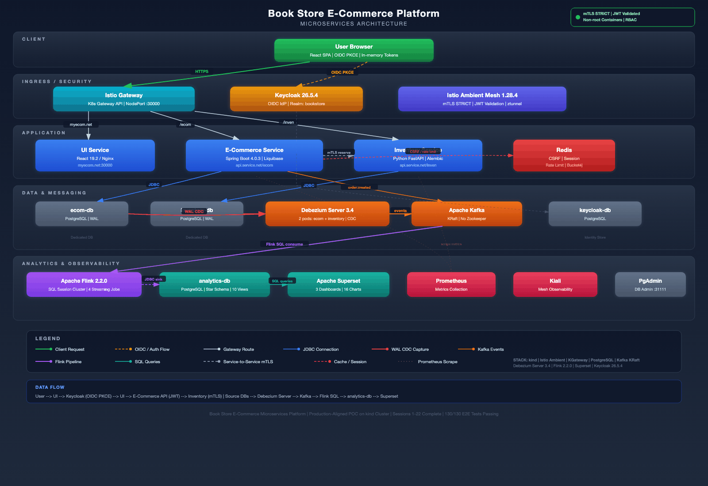
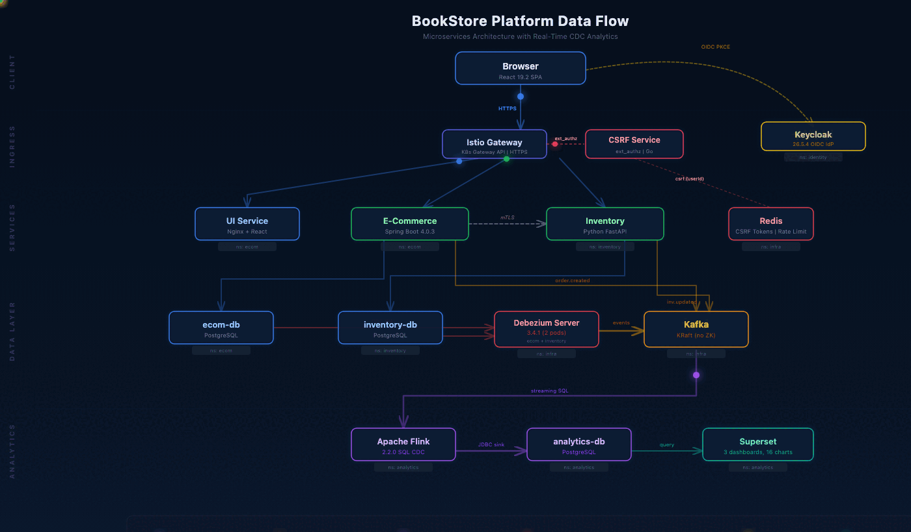

# BookStore Platform — Architecture Summary

## Overview

A production-grade microservices e-commerce bookstore deployed to Kubernetes, demonstrating real-world architecture patterns including zero-trust networking, event-driven data pipelines, and real-time analytics. Built as a proof of concept with production-aligned infrastructure — every component follows the same patterns used in large-scale distributed systems.

## Infrastructure Architecture

<p align="center">
  
</p>

## Architecture at a Glance

| Layer | Components | Technology |
|-------|-----------|------------|
| **Client** | Single-page application, OIDC login | React 19.2 + Vite, PKCE (S256) |
| **Ingress / Security** | Gateway routing, TLS termination, mTLS mesh, JWT validation | Istio Ambient 1.28.4, K8s Gateway API, cert-manager 1.17.2 |
| **Application Services** | E-Commerce API, Inventory API, Admin API | Spring Boot 4.0.3, FastAPI |
| **Identity** | OIDC provider, RBAC, realm management | Keycloak 26.5.4 |
| **Data & Messaging** | 4 isolated databases, event streaming, CDC | PostgreSQL, Kafka KRaft, Debezium Server 3.4 |
| **Analytics & BI** | Stream processing, star schema, dashboards | Flink 2.2.0 SQL, Superset (3 dashboards, 16 charts) |
| **Observability** | Metrics, tracing, logs, service mesh visualization, DB admin | Prometheus, Grafana, Loki, Tempo, Kiali, OTel Collector, PgAdmin |
| **Operations** | Certificate monitoring, renewal dashboard, operator lifecycle | Cert Dashboard Operator (OLM), cert-manager 1.17.2 |

## Key Architecture Decisions

### TLS / Certificate Management

All external-facing endpoints serve HTTPS via a self-signed CA managed by cert-manager v1.17.2. A single multi-SAN certificate covers all 4 hostnames (myecom.net, api.service.net, idp.keycloak.net, localhost) plus 127.0.0.1. TLS terminates at the Istio Gateway (port 8443, NodePort 30000). Certificates auto-rotate every 30 days (renewBefore: 7 days). The CA certificate (10-year validity) is extracted and optionally installed into the macOS Keychain during bootstrap. HTTP requests on port 30080 redirect to HTTPS with 301.

### Service Mesh & Zero Trust

Istio Ambient Mesh provides mutual TLS across all service-to-service communication without sidecar proxy overhead. ztunnel handles L4 encryption transparently. AuthorizationPolicies operate at L4 only (namespace + SPIFFE principal), compatible with the sidecar-free ambient model. JWT validation occurs independently at every backend service — no service trusts upstream claims.

### Authentication & Authorization

Keycloak serves as the OIDC Identity Provider. The React SPA uses Authorization Code Flow with PKCE (S256 challenge), storing tokens exclusively in memory — never in localStorage or sessionStorage. Role-based access control distinguishes `customer` and `admin` realm roles, enforced at both the API gateway and individual service layers.

### Event-Driven Architecture

Change Data Capture runs through two Debezium Server 3.4 pods (one per source database), capturing PostgreSQL WAL changes into Kafka topics. Apache Flink 2.2.0 runs four streaming SQL jobs with exactly-once semantics, transforming CDC events into a star schema in the analytics database. Kafka runs in KRaft mode (no Zookeeper dependency).

### Data Architecture

Strict database-per-service isolation: four PostgreSQL instances with no cross-database access. Schema migrations run as Kubernetes init containers (Liquibase for Java, Alembic for Python). The analytics database uses a star schema with fact tables, dimension tables, and 10 materialized views powering Superset dashboards.

### API Design

RESTful APIs built with Spring Boot 4.0.3 (Java) and FastAPI (Python). Kubernetes Gateway API handles all ingress routing via HTTPRoutes — no Ingress resources. Rate limiting uses Bucket4j backed by Redis. CSRF tokens are stored server-side in Redis and required for all state-changing requests.

### Observability Stack

Prometheus scrapes Istio telemetry (istiod + ztunnel) and application metrics. Grafana provides unified dashboards for metrics, logs (via Loki), and traces (via Tempo). OTel Collector receives telemetry from application services and routes to Loki/Tempo backends. Kiali provides real-time service mesh topology visualization with traffic flow. Apache Superset delivers business analytics across three dashboards with 16 charts covering sales, inventory, and revenue.

### Certificate Operations

The cert-dashboard-operator is a Go-based Kubernetes operator (OLM-managed, Capability Level 3) that deploys a web dashboard for monitoring and renewing cert-manager certificates. It displays certificate lifecycle status with color-coded progress bars (green > 10d, yellow <= 10d, red <= 5d), provides one-click renewal with SSE live streaming, and auto-refreshes every 30 seconds. Accessible at NodePort 32600. Security hardened with Kubernetes TokenReview authentication on mutating endpoints, rate limiting, CRD validation webhook, and 5 Prometheus custom metrics (`cert_dashboard_*`) for operational observability. Pod security follows the Kubernetes restricted PSS profile (seccomp RuntimeDefault, capabilities drop ALL, non-root uid 1000).

## Data Flow

<p align="center">
  
</p>

**User Request Flow:**
```
Browser (HTTPS) → Istio Gateway (TLS termination) → UI Service (React SPA)
Browser (HTTPS) → Keycloak (OIDC PKCE login)
UI → E-Commerce API (JWT-protected)
E-Commerce → Inventory Service (service-to-service mTLS)
```

**CDC Pipeline:**
```
Source DBs → Debezium Server 3.4 → Kafka → Flink 2.2.0 SQL → analytics-db → Superset
```

**Checkout Flow:**
1. User submits checkout — E-Commerce Service validates cart and JWT
2. E-Commerce calls Inventory Service over mTLS to reserve stock
3. Order persisted to database; `order.created` event published to Kafka
4. Debezium captures the DB change → Kafka → Flink transforms → analytics-db
5. Superset dashboards reflect new order data in real time

## Security Invariants

- All external traffic encrypted via TLS (HTTPS on port 30000, cert-manager auto-rotation)
- All inter-service traffic encrypted via Istio mTLS (STRICT mode)
- JWT validated independently at every backend service
- Non-root containers with read-only root filesystems and all capabilities dropped
- Secrets managed exclusively through Kubernetes Secrets (no hardcoded config)
- NetworkPolicies enforced per namespace
- CSRF tokens stored server-side in Redis
- HTTP→HTTPS redirect on port 30080 (301 Moved Permanently)

## Infrastructure

- Local Kubernetes via kind (3 nodes: 1 control-plane, 2 workers)
- 12 NodePort services exposed directly via kind host port mappings (HTTPS :30000, HTTP redirect :30080, plus 10 tool ports)
- No `kubectl port-forward` used anywhere — all access via stable ports
- All stateful services backed by PersistentVolumeClaims with host-path storage
- cert-manager v1.17.2 for automated certificate lifecycle (issuance + 30-day rotation)
- Idempotent shell scripts for full cluster lifecycle (bootstrap, recovery, teardown)

## Test Coverage

- E2E tests via Playwright (all passing)
- TLS/cert-manager E2E tests: certificate chain, SANs, rotation, HTTPS connectivity, HTTP→HTTPS redirect
- Unit tests for both backend services (JUnit, pytest)
- CDC pipeline verification: insert → poll analytics DB within 30s
- Smoke tests covering pods, HTTPS routes, Kafka, and Debezium health

## Technology Stack

| Category | Technology | Version |
|----------|-----------|---------|
| Frontend | React + Vite | 19.2 |
| Backend (Java) | Spring Boot | 4.0.3 |
| Backend (Python) | FastAPI | latest |
| Identity | Keycloak | 26.5.4 |
| Service Mesh | Istio Ambient | 1.28.4 |
| Gateway | Kubernetes Gateway API | istio |
| Databases | PostgreSQL | 4 instances |
| Messaging | Apache Kafka | KRaft mode |
| CDC | Debezium Server | 3.4.1 |
| Stream Processing | Apache Flink | 2.2.0 |
| BI / Analytics | Apache Superset | latest |
| Certificate Management | cert-manager | 1.17.2 |
| Observability | Prometheus, Grafana, Loki, Tempo, Kiali | — |
| Telemetry Pipeline | OpenTelemetry Collector | — |
| Cert Operations | Cert Dashboard Operator (Go, OLM) | v0.0.1 |
| Cache / Sessions | Redis | — |
| E2E Testing | Playwright | latest |
| Container Orchestration | Kubernetes (kind) | — |

## Diagrams

| Diagram | Format | Description |
|---------|--------|-------------|
| [Architecture (GIF)](../diagrams/architecture.gif) | GIF (231 KB) | Static infrastructure overview — shareable on LinkedIn |
| [Architecture (SVG)](../diagrams/architecture.svg) | SVG (31 KB) | High-resolution vector version |
| [Data Flow (GIF)](../diagrams/data-flow.gif) | GIF (4.7 MB) | Animated data flow with live request paths — shareable on LinkedIn |
| [Data Flow (SVG)](../diagrams/data-flow-animated.svg) | SVG (24 KB) | Interactive animated version (open in browser) |

---

*Built as a production-grade proof of concept demonstrating microservices best practices, zero-trust security, TLS everywhere, event-driven architecture, and real-time analytics.*
