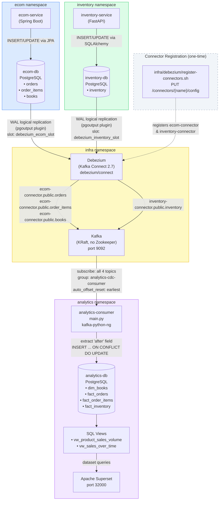

# CDC Flow — Change Data Capture Pipeline

This document explains how the CDC (Change Data Capture) pipeline works end to end: from a database row change in a source service, through Debezium and Kafka, to the analytics database — and ultimately to the Superset dashboards.

---

## High-Level Flow

```
ecom-db (PostgreSQL WAL)  ──┐
                             ├──► Debezium (Kafka Connect) ──► Kafka Topics ──► analytics-consumer ──► analytics-db ──► Superset
inventory-db (PostgreSQL WAL)┘
```

There are three distinct stages:

| Stage | Component | Role |
|-------|-----------|------|
| 1 | Debezium | Reads PostgreSQL Write-Ahead Log (WAL) and publishes row changes to Kafka |
| 2 | Kafka | Durable ordered log; decouples Debezium from the consumer |
| 3 | `analytics/consumer/main.py` | Consumes CDC events from Kafka and upserts into analytics DB |

---

## Stage 1 — Debezium: Reading the WAL

### What Debezium Does

Debezium runs as a **Kafka Connect worker** (`debezium/connect:2.7.0.Final`) inside the `infra` namespace. It does not query the source databases with `SELECT` statements. Instead, it acts as a **PostgreSQL logical replication client** — the same mechanism used for streaming replication — and reads the Write-Ahead Log (WAL) in real time.

Every INSERT, UPDATE, and DELETE committed to the source PostgreSQL tables produces a record in the WAL. Debezium reads these records and converts them into structured JSON messages, then publishes each one to a dedicated Kafka topic.

### PostgreSQL Prerequisites

For Debezium to read the WAL, each source PostgreSQL instance must be configured with:

```
wal_level = logical          # enables logical replication (default is 'replica')
max_replication_slots = 10   # slots reserved for consumers
max_wal_senders = 10         # max concurrent WAL streaming connections
```

These are set via `POSTGRES_INITDB_ARGS` in the PostgreSQL pod environment variables.

### How Debezium is Deployed

`infra/debezium/debezium.yaml` deploys a single Kafka Connect pod in the `infra` namespace with these key settings:

```yaml
env:
  - name: BOOTSTRAP_SERVERS
    value: "kafka.infra.svc.cluster.local:9092"   # where to publish CDC events
  - name: GROUP_ID
    value: "debezium-connect-cluster"              # identifies this connect cluster
  - name: CONFIG_STORAGE_TOPIC
    value: "debezium.configs"                      # connector configs stored here
  - name: OFFSET_STORAGE_TOPIC
    value: "debezium.offsets"                      # WAL read position stored here
  - name: STATUS_STORAGE_TOPIC
    value: "debezium.status"                       # connector health stored here
  # Schemaless JSON — no Avro/Schema Registry needed
  - name: CONNECT_KEY_CONVERTER_SCHEMAS_ENABLE
    value: "false"
  - name: CONNECT_VALUE_CONVERTER_SCHEMAS_ENABLE
    value: "false"
  # Enables ${file:...} variable substitution for credentials
  - name: CONNECT_CONFIG_PROVIDERS
    value: "file"
  - name: CONNECT_CONFIG_PROVIDERS_FILE_CLASS
    value: "org.apache.kafka.common.config.provider.FileConfigProvider"
```

**Credentials are never hardcoded.** They are stored in a Kubernetes Secret (`debezium-db-credentials`) and mounted as files at `/opt/kafka/external-configuration/db-credentials/`. The connector JSON references them as:

```json
"database.user": "${file:/opt/kafka/external-configuration/db-credentials/ECOM_DB_USER}"
```

The `FileConfigProvider` resolves these at runtime by reading the mounted file content.

### Connector Registration

Debezium starts with no connectors. They are registered at runtime via the **Kafka Connect REST API** (`POST /connectors` or `PUT /connectors/{name}/config`). The script `infra/debezium/register-connectors.sh` does this:

```bash
# Idempotent — uses PUT (create-or-update)
curl -X PUT \
  -H "Content-Type: application/json" \
  --data "@infra/debezium/connectors/ecom-connector.json" \
  "http://debezium-service:8083/connectors/ecom-connector/config"
```

The script waits for Debezium's `/connectors` endpoint to respond before attempting registration, then polls each connector's status to confirm `RUNNING`.

### The Two Connectors

**`ecom-connector`** (`infra/debezium/connectors/ecom-connector.json`):

```json
{
  "connector.class": "io.debezium.connector.postgresql.PostgresConnector",
  "plugin.name": "pgoutput",           // built-in PostgreSQL logical decoding plugin
  "database.hostname": "ecom-db.ecom.svc.cluster.local",
  "database.dbname": "ecomdb",
  "table.include.list": "public.orders,public.order_items,public.books",
  "topic.prefix": "ecom-connector",    // topics will be: ecom-connector.public.orders etc.
  "slot.name": "debezium_ecom_slot",   // replication slot name (persists WAL position)
  "publication.name": "debezium_ecom_pub",  // PostgreSQL publication (which tables to stream)
  "snapshot.mode": "initial"           // on first connect, snapshot existing rows before streaming live changes
}
```

**`inventory-connector`** (`infra/debezium/connectors/inventory-connector.json`):

```json
{
  "connector.class": "io.debezium.connector.postgresql.PostgresConnector",
  "database.hostname": "inventory-db.inventory.svc.cluster.local",
  "database.dbname": "inventorydb",
  "table.include.list": "public.inventory",
  "topic.prefix": "inventory-connector",
  "slot.name": "debezium_inventory_slot"
}
```

### Kafka Topic Naming

Topic names follow the pattern: `<topic.prefix>.<schema>.<table>`

| Source Table | Kafka Topic |
|---|---|
| `ecomdb.public.orders` | `ecom-connector.public.orders` |
| `ecomdb.public.order_items` | `ecom-connector.public.order_items` |
| `ecomdb.public.books` | `ecom-connector.public.books` |
| `inventorydb.public.inventory` | `inventory-connector.public.inventory` |

### Debezium Message Envelope

Each Kafka message produced by Debezium wraps the row data in an **envelope**:

```json
{
  "op": "c",         // operation: c=create, u=update, d=delete, r=read(snapshot)
  "before": null,    // row state BEFORE the change (null for inserts)
  "after": {         // row state AFTER the change (null for deletes)
    "id": "uuid",
    "user_id": "keycloak-sub",
    "total": 39.98,
    "status": "CONFIRMED",
    "created_at": 1234567890000
  },
  "source": {
    "db": "ecomdb",
    "table": "orders",
    "lsn": 12345678  // WAL log sequence number
  },
  "ts_ms": 1234567890000
}
```

Because `schemas.enable: false` is set on both connectors, **no Avro schema is embedded** in the message. The message is plain schemaless JSON. This is why the standard Debezium JDBC Sink Connector cannot be used here — it calls `valueSchema()` internally which throws a NullPointerException on schemaless messages. This is exactly why `analytics/consumer/main.py` exists.

---

## Stage 2 — Kafka: Durable Event Bus

Kafka (KRaft mode, no Zookeeper) acts as the buffer between Debezium and the analytics consumer. Key properties:

- **Ordered delivery**: within a topic-partition, messages are strictly ordered (same row changes always come in order)
- **Consumer group offset tracking**: the analytics consumer uses group ID `analytics-cdc-consumer`. Kafka tracks how far it has read. If the consumer restarts, it resumes from where it stopped (no data loss, no duplication)
- **`auto_offset_reset: "earliest"`**: on first start (no committed offset yet), the consumer reads all historical messages from the beginning — this is how existing data is backfilled into the analytics DB

---

## Stage 3 — `analytics/consumer/main.py`: The Analytics Writer

### Why It Exists

The Debezium **JDBC Sink Connector** (the standard solution) throws a `NullPointerException` when the source connector uses `schemas.enable: false` (schemaless JSON). It calls `record.valueSchema()` internally, which returns `null`, and crashes. Since all connectors in this project deliberately use schemaless JSON (simpler, no Schema Registry needed), the JDBC sink is unusable.

`analytics/consumer/main.py` is a **custom Python Kafka consumer** that handles schemaless Debezium envelopes correctly.

### What It Does

The consumer runs as a long-lived Python process (`bookstore/analytics-consumer:latest`) deployed to the `analytics` namespace. It:

1. **Connects to Kafka** — subscribes to all 4 CDC topics simultaneously under one consumer group
2. **Connects to analytics DB** — single persistent PostgreSQL connection
3. **Processes each Kafka message** — extracts the `after` field from the Debezium envelope
4. **Upserts into the analytics table** — using `INSERT ... ON CONFLICT DO UPDATE`

### Topic-to-Table Routing

The `TOPIC_CONFIG` dictionary is the core routing table:

```python
TOPIC_CONFIG = {
    "ecom-connector.public.orders": (
        "fact_orders",          # analytics table to write into
        "id",                   # primary key column (for ON CONFLICT)
        ["id", "user_id", "total", "status", "created_at"]  # columns to write
    ),
    "ecom-connector.public.order_items": (
        "fact_order_items",
        "id",
        ["id", "order_id", "book_id", "quantity", "price_at_purchase"]
    ),
    "ecom-connector.public.books": (
        "dim_books",
        "id",
        ["id", "title", "author", "price", "description", "cover_url",
         "isbn", "genre", "published_year", "created_at"]
    ),
    "inventory-connector.public.inventory": (
        "fact_inventory",
        "book_id",              # inventory PK is book_id, not id
        ["book_id", "quantity", "reserved", "updated_at"]
    ),
}
```

### Envelope Parsing Logic

```python
if "after" in value:
    after = value["after"]   # Debezium CDC envelope — extract the row
    op = value.get("op", "r")
    if after is None or op == "d":
        continue             # skip deletes — analytics is append-only
else:
    after = value            # flat record (snapshot mode or legacy format)
```

### The Upsert

```sql
INSERT INTO fact_orders (id, user_id, total, status, created_at)
VALUES (%s, %s, %s, %s, %s)
ON CONFLICT (id) DO UPDATE SET
    user_id    = EXCLUDED.user_id,
    total      = EXCLUDED.total,
    status     = EXCLUDED.status,
    created_at = EXCLUDED.created_at
```

`ON CONFLICT DO UPDATE` makes every write **idempotent** — replaying the same message twice produces the same result. This is critical because Kafka's `at-least-once` delivery guarantee means a message can be delivered more than once (e.g., on consumer restart before offset commit).

### Resilience

- **DB reconnect loop**: if the analytics DB connection drops, the consumer reconnects and retries the failed upsert
- **Kafka reconnect loop**: if Kafka is unavailable at startup, the consumer retries every 5 seconds
- **No FK constraints on analytics tables**: because CDC delivery order across topics is not guaranteed (an `order_item` might arrive before its `order`), the analytics schema has no foreign key constraints — rows just coexist

---

## Analytics Database Schema

Tables in `analytics-db` (`analytics` namespace):

```
dim_books          — book catalogue mirror (from ecom-connector.public.books)
fact_orders        — order header mirror (from ecom-connector.public.orders)
fact_order_items   — order line items (from ecom-connector.public.order_items)
fact_inventory     — current stock levels (from inventory-connector.public.inventory)
```

Two views are created on top for Superset:

```sql
-- Product Sales Volume (bar chart): units sold per book
vw_product_sales_volume
  → JOIN fact_order_items + dim_books + fact_orders (WHERE status != 'CANCELLED')
  → SUM(quantity) AS units_sold, SUM(quantity * price) AS revenue

-- Sales Over Time (trend chart): daily revenue
vw_sales_over_time
  → GROUP BY DATE(created_at)
  → COUNT(orders), SUM(total) AS daily_revenue
```

---

## Mermaid Diagram



---

## End-to-End Walkthrough: A User Places an Order

To make the flow concrete, here is what happens when a user checks out:

1. **User submits checkout** → `ecom-service` calls `inventoryClient.reserve()` (mTLS to inventory-service), then creates an order row in `ecom-db.orders` and rows in `ecom-db.order_items`

2. **PostgreSQL writes to WAL** → the committed INSERT is recorded in the Write-Ahead Log with a Log Sequence Number (LSN)

3. **Debezium reads the WAL** → `ecom-connector` is subscribed to `public.orders` and `public.order_items` via logical replication slot `debezium_ecom_slot`. It reads the new WAL records within milliseconds

4. **Debezium produces to Kafka** → two messages are published:
   - `ecom-connector.public.orders` — the order header
   - `ecom-connector.public.order_items` — one message per line item

5. **inventory-service deducts stock** → when the Kafka consumer in inventory-service processes the `order.created` event (published separately by ecom-service), it updates `inventory-db.public.inventory`. Debezium's `inventory-connector` immediately picks this up and publishes to `inventory-connector.public.inventory`

6. **`analytics/consumer/main.py` receives all 3 events** → for each message it:
   - Parses the Debezium envelope (`value["after"]`)
   - Looks up the target table and columns from `TOPIC_CONFIG`
   - Executes `INSERT ... ON CONFLICT DO UPDATE` into the correct analytics table

7. **Superset queries the views** → `vw_product_sales_volume` and `vw_sales_over_time` now reflect the new order. The bar chart and trend chart in the "Book Store Analytics" dashboard update on next refresh

---

## Operational Notes

| Task | Command |
|------|---------|
| Register connectors | `bash infra/debezium/register-connectors.sh` |
| Check connector status | `curl http://localhost:8083/connectors/ecom-connector/status` |
| Check consumer lag | `kubectl exec -n infra deploy/kafka -- kafka-consumer-groups.sh --bootstrap-server localhost:9092 --describe --group analytics-cdc-consumer` |
| Verify CDC end-to-end | `bash scripts/verify-cdc.sh` (inserts a test row, polls analytics DB for 30s) |
| Restart analytics consumer | `kubectl rollout restart deployment/analytics-consumer -n analytics` |
| View consumer logs | `kubectl logs -n analytics deployment/analytics-consumer -f` |
