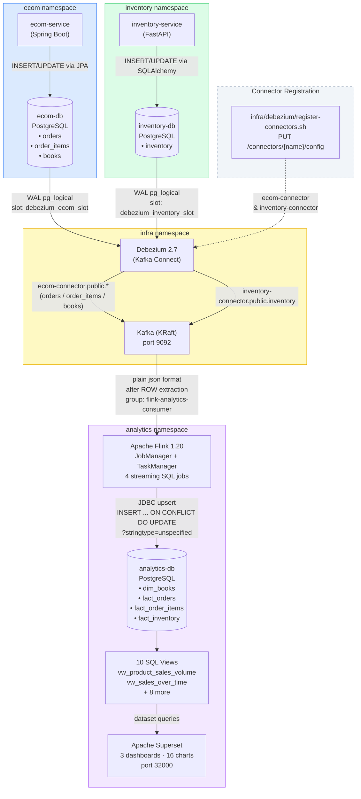

# CDC Flow — Change Data Capture Pipeline

> **Session 18 update:** The Python analytics consumer (`analytics/consumer/main.py`) was replaced
> by **Apache Flink 1.20 SQL** in Session 18. This document has been updated to reflect the current
> Flink-based architecture. For the full technical deep-dive see
> [`docs/debezium-flink-cdc.md`](./debezium-flink-cdc.md).

---

## High-Level Flow

```
ecom-db (PostgreSQL WAL)  ──┐
                             ├──► Debezium (Kafka Connect) ──► Kafka Topics ──► Flink SQL ──► analytics-db ──► Superset
inventory-db (PostgreSQL WAL)┘                                                  (4 jobs)      (star schema)   (3 dashboards)
```

There are three distinct stages:

| Stage | Component | Role |
|-------|-----------|------|
| 1 | **Debezium 2.7.0** | Reads PostgreSQL Write-Ahead Log (WAL); publishes row changes to Kafka topics |
| 2 | **Apache Kafka (KRaft)** | Durable ordered log; decouples producers from consumers |
| 3 | **Apache Flink 1.20** | Streaming SQL jobs consume Kafka CDC events and upsert into analytics DB via JDBC |

---

## Stage 1 — Debezium: Reading the WAL

Debezium runs as a **Kafka Connect worker** (`debezium/connect:2.7.0.Final`) inside the `infra`
namespace. It acts as a **PostgreSQL logical replication client** and reads the Write-Ahead Log in
real time — no `SELECT` polling.

### PostgreSQL Prerequisites

```
wal_level = logical          # enables logical replication
max_replication_slots = 10
max_wal_senders = 10
```

Set via `POSTGRES_INITDB_ARGS` in each PostgreSQL pod.

### Connector Registration

Connectors are registered at runtime via `infra/debezium/register-connectors.sh`. The script:

1. Waits for Debezium's `/connectors` endpoint to respond
2. Reads credentials from the `debezium-db-credentials` Kubernetes Secret
3. PUTs each connector config (idempotent create-or-update)
4. Polls until both connectors reach `RUNNING` state

> **Important:** `${file:...}` FileConfigProvider syntax does NOT expand during PUT validation.
> The script injects real credentials inline — never send literal `${file:...}` strings.

### Kafka Topic Naming

Topic names follow: `<connector-name>.<schema>.<table>`

| Source Table | Kafka Topic |
|---|---|
| `ecomdb.public.orders` | `ecom-connector.public.orders` |
| `ecomdb.public.order_items` | `ecom-connector.public.order_items` |
| `ecomdb.public.books` | `ecom-connector.public.books` |
| `inventorydb.public.inventory` | `inventory-connector.public.inventory` |

### Debezium Message Envelope

```json
{
  "op": "c",
  "before": null,
  "after": {
    "id": "uuid",
    "user_id": "keycloak-sub",
    "total": 39.98,
    "status": "CONFIRMED",
    "created_at": "2026-02-26T18:58:09.811060Z"
  },
  "source": { "db": "ecomdb", "table": "orders" },
  "ts_ms": 1740592689811
}
```

`schemas.enable: false` — plain schemaless JSON, no Avro/Schema Registry.

---

## Stage 2 — Kafka: Durable Event Bus

- **KRaft mode** — no Zookeeper
- **Ordered delivery** — per partition, all changes to the same row arrive in order
- **Consumer group offset tracking** — Flink's consumer group `flink-analytics-consumer` resumes
  from its committed offset on restart; no data loss or duplication

---

## Stage 3 — Apache Flink SQL: Streaming Pipeline

Flink replaces the former Python analytics consumer. It processes CDC events using 4 continuous
`INSERT INTO` SQL statements, running as a **Flink Session Cluster** in the `analytics` namespace.

### Why Flink (not the Python consumer)

The previous Python consumer (`analytics/consumer/main.py`) handled schemaless Debezium envelopes
manually via `INSERT ... ON CONFLICT DO UPDATE`. It was replaced by Flink because:

- **Exactly-once** — Flink checkpoints + Kafka offset atomicity prevent any duplicate rows; the
  Python consumer offered only at-least-once (idempotent upserts as mitigation)
- **Scalability** — Flink TaskManagers scale horizontally; the Python consumer was single-threaded
- **Native CDC support** — `plain json` format + `after ROW<...>` field extraction is idiomatic SQL;
  no custom envelope parsing code required
- **State management** — PVC-backed checkpoints at `/opt/flink/checkpoints` survive pod restarts

### Flink SQL Format

The pipeline uses plain `json` format (NOT `debezium-json`). This avoids the `REPLICA IDENTITY FULL`
requirement on source tables. Each source table defines an `after ROW<...>` field matching the
Debezium envelope:

```sql
CREATE TABLE kafka_orders (
  op    STRING,
  after ROW<
    id         STRING,
    user_id    STRING,
    total      DOUBLE,
    status     STRING,
    created_at STRING   -- ISO-8601 from Debezium; converted via CAST(REPLACE(...))
  >
) WITH (
  'connector'                    = 'kafka',
  'topic'                        = 'ecom-connector.public.orders',
  'properties.bootstrap.servers' = 'kafka.infra.svc.cluster.local:9092',
  'properties.group.id'          = 'flink-analytics-consumer',
  'format'                       = 'json',
  'scan.startup.mode'            = 'earliest-offset'
);
```

Timestamp conversion (Debezium ISO-8601 → SQL TIMESTAMP):

```sql
CAST(REPLACE(REPLACE(o.after.created_at, 'T', ' '), 'Z', '') AS TIMESTAMP(3))
```

JDBC sink uses `?stringtype=unspecified` in the URL for implicit `varchar → uuid` casts.

### Exactly-Once

```
Checkpoint interval: 30s
Mode: EXACTLY_ONCE
Storage: filesystem at /opt/flink/checkpoints (PVC: flink-checkpoints-pvc)
```

---

## Analytics Database Schema

```
dim_books          — book catalogue mirror (4 fact/dim tables total)
fact_orders        — order header
fact_order_items   — order line items
fact_inventory     — current stock levels
```

10 views created on top for Superset:

```
vw_product_sales_volume    vw_sales_over_time         vw_revenue_by_author
vw_revenue_by_genre        vw_order_status_distribution  vw_inventory_health
vw_avg_order_value         vw_top_books_by_revenue    vw_inventory_turnover
vw_book_price_distribution
```

---

## Superset Dashboards

Three dashboards are auto-created by a Kubernetes bootstrap Job
(`infra/superset/bootstrap-job.yaml`) on first cluster startup. The Job runs inside the Superset
pod using the built-in venv Python — no pip install required.

| Dashboard | Charts |
|-----------|--------|
| **Book Store Analytics** | Product Sales Volume · Sales Over Time · Revenue by Author · Top Books by Revenue · Book Price Distribution |
| **Sales & Revenue Analytics** | Total Revenue KPI · Total Orders KPI · Avg Order Value KPI · Order Status Distribution · Avg Order Value Over Time |
| **Inventory Analytics** | Inventory Health Table · Stock vs Reserved · Inventory Turnover Rate · Revenue by Genre · Stock Status Distribution · Revenue Share by Genre |

**Bootstrap bug fixed:** Superset `table` chart `order_by_cols` format requires each element to be
a JSON-encoded `[column, is_descending]` string (e.g. `'["available", false]'`). The `upsert_chart`
PUT also requires `slice_name` + `datasource_type` in the request body; previously missing fields
caused silent HTTP 500 and prevented chart updates on re-runs.

---

## Mermaid Diagram


```mermaid
flowchart TD
    subgraph ecom_ns["ecom namespace"]
        ES["ecom-service\n(Spring Boot)"]
        ECOMDB[("ecom-db\nPostgreSQL\n• orders\n• order_items\n• books")]
        ES -- "INSERT/UPDATE via JPA" --> ECOMDB
    end

    subgraph inventory_ns["inventory namespace"]
        IS["inventory-service\n(FastAPI)"]
        INVDB[("inventory-db\nPostgreSQL\n• inventory")]
        IS -- "INSERT/UPDATE via SQLAlchemy" --> INVDB
    end

    subgraph infra_ns["infra namespace"]
        DEB["Debezium 2.7\n(Kafka Connect)"]
        KAFKA["Kafka (KRaft)\nport 9092"]

        ECOMDB -- "WAL pg_logical\nslot: debezium_ecom_slot" --> DEB
        INVDB  -- "WAL pg_logical\nslot: debezium_inventory_slot" --> DEB

        DEB -- "ecom-connector.public.*\n(orders / order_items / books)" --> KAFKA
        DEB -- "inventory-connector.public.inventory" --> KAFKA
    end

    subgraph analytics_ns["analytics namespace"]
        FM["Apache Flink 1.20\nJobManager + TaskManager\n4 streaming SQL jobs"]
        ANALYTICSDB[("analytics-db\nPostgreSQL\n• dim_books\n• fact_orders\n• fact_order_items\n• fact_inventory")]
        VIEWS["10 SQL Views\nvw_product_sales_volume\nvw_sales_over_time\n+ 8 more"]
        SUP["Apache Superset\n3 dashboards · 16 charts\nport 32000"]

        KAFKA -- "plain json format\nafter ROW extraction\ngroup: flink-analytics-consumer" --> FM
        FM -- "JDBC upsert\nINSERT ... ON CONFLICT DO UPDATE\n?stringtype=unspecified" --> ANALYTICSDB
        ANALYTICSDB --> VIEWS
        VIEWS -- "dataset queries" --> SUP
    end

    subgraph reg["Connector Registration"]
        SCRIPT["infra/debezium/register-connectors.sh\nPUT /connectors/{name}/config"]
        SCRIPT -. "ecom-connector\n& inventory-connector" .-> DEB
    end

    style ecom_ns fill:#dbeafe,stroke:#3b82f6
    style inventory_ns fill:#dcfce7,stroke:#22c55e
    style infra_ns fill:#fef9c3,stroke:#eab308
    style analytics_ns fill:#f3e8ff,stroke:#a855f7
    style reg fill:#f1f5f9,stroke:#94a3b8,stroke-dasharray:5
```

---

## End-to-End Walkthrough: A User Places an Order

1. **User submits checkout** → `ecom-service` calls `inventoryClient.reserve()` (mTLS), creates
   order rows in `ecom-db.orders` and `ecom-db.order_items`

2. **PostgreSQL writes to WAL** → committed INSERT recorded with a Log Sequence Number

3. **Debezium reads the WAL** → `ecom-connector` picks up new records via logical replication slot
   within milliseconds

4. **Debezium produces to Kafka** → two messages published:
   - `ecom-connector.public.orders` — order header
   - `ecom-connector.public.order_items` — one message per line item

5. **Inventory stock deducted** → `inventory-service` processes `order.created` from Kafka,
   updates `inventory-db.inventory`. `inventory-connector` publishes to
   `inventory-connector.public.inventory`

6. **Flink SQL jobs receive all events** → each job:
   - Reads from its Kafka source table using plain `json` format
   - Extracts the `after` ROW field (`WHERE after IS NOT NULL` skips deletes)
   - Converts timestamps via `CAST(REPLACE(REPLACE(...,'T',' '),'Z','') AS TIMESTAMP(3))`
   - Executes JDBC upsert via `INSERT INTO sink_* SELECT ... FROM kafka_*`

7. **Superset queries views** → `vw_product_sales_volume`, `vw_sales_over_time` and 8 other views
   reflect the new order. All three dashboards update on next page refresh

Total end-to-end latency: **< 5 seconds**

---

## Operational Notes

| Task | Command |
|------|---------|
| Register connectors | `bash infra/debezium/register-connectors.sh` |
| Check connector status | `curl http://localhost:32300/connectors/ecom-connector/status` |
| List Flink jobs | `curl http://localhost:32200/jobs` |
| Check Flink checkpoints | `curl http://localhost:32200/jobs/<id>/checkpoints` |
| Verify CDC end-to-end | `bash scripts/verify-cdc.sh` |
| Flink Web UI | `http://localhost:32200` |
| Debezium REST API | `http://localhost:32300` |
| Re-run Superset bootstrap | `kubectl delete job superset-bootstrap -n analytics && kubectl apply -f infra/superset/bootstrap-job.yaml` |
| View Flink logs | `kubectl logs -n analytics deploy/flink-jobmanager -f` |
| View Debezium logs | `kubectl logs -n infra deploy/debezium -f` |
