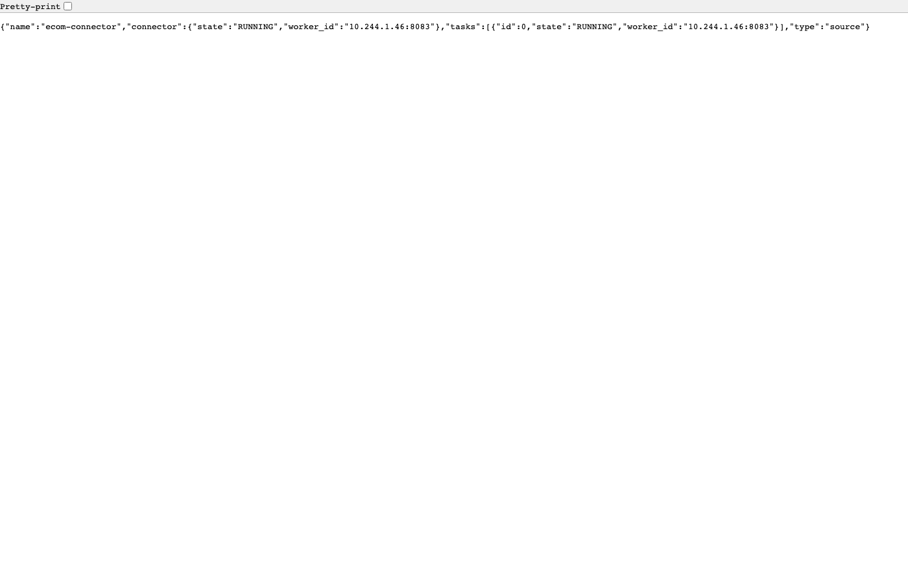
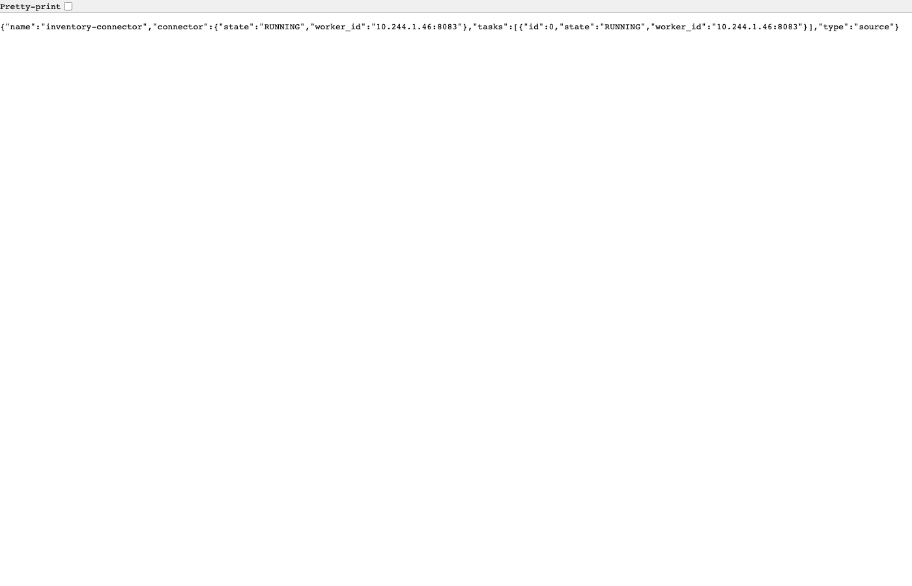
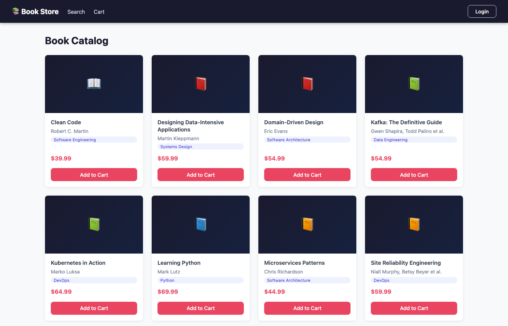
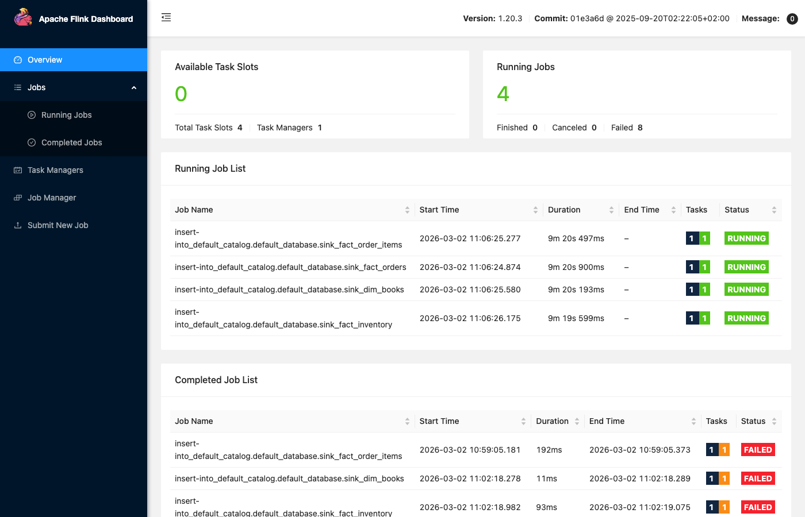
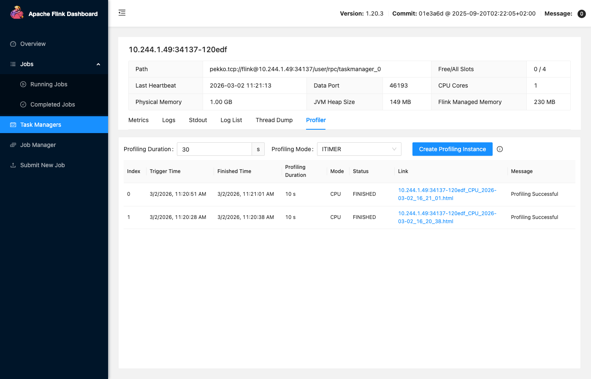
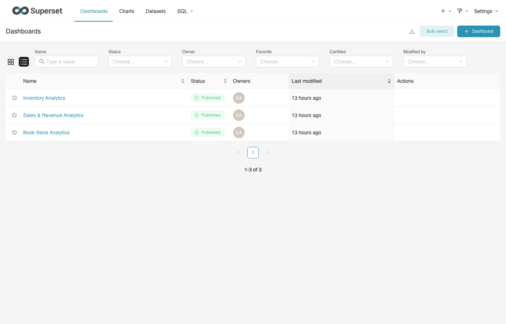

# Step-by-Step CDC Simulation Guide
## Watching Data Flow: Application → Debezium → Kafka → Apache Flink → Analytics DB → Superset

> **What this guide does:** Walks you through the complete Change Data Capture (CDC) pipeline
> end-to-end. You will place a real order through the UI or API, then watch the data propagate
> in real time through every layer — Debezium, Kafka, Flink SQL, analytics-db, and finally
> appear in Superset dashboards.
>
> **Time to complete:** ~30 minutes for the full walkthrough
>
> **Prerequisite:** Cluster is running (`bash scripts/up.sh` from the repo root)

---

## The Full Pipeline at a Glance

```
┌────────────────────────────────────────────────────────────────────────────────────┐
│                          CDC DATA FLOW                                              │
│                                                                                     │
│  ┌─────────────┐    ┌──────────────┐    ┌──────────┐    ┌─────────┐    ┌────────┐ │
│  │  ecom-db    │───►│  Debezium    │───►│  Kafka   │───►│  Flink  │───►│analytics│ │
│  │  (orders,   │    │  (reads WAL, │    │  (4 CDC  │    │  SQL    │    │  -db   │ │
│  │  order_items│    │   publishes  │    │  topics) │    │  (4     │    │(fact_* │ │
│  │  books)     │    │   to Kafka)  │    │          │    │  jobs)  │    │ dim_*) │ │
│  └─────────────┘    └──────────────┘    └──────────┘    └─────────┘    └───┬────┘ │
│                                                                              │      │
│  ┌─────────────┐    ┌──────────────┐    ┌──────────┐                        │      │
│  │inventory-db │───►│  Debezium    │───►│  Kafka   │                        │      │
│  │ (inventory) │    │  (inventory  │    │(inventory│                        │      │
│  │             │    │  connector)  │    │ topic)   │                        ▼      │
│  └─────────────┘    └──────────────┘    └──────────┘              ┌──────────────┐ │
│                                                                    │   Superset   │ │
│  User → UI → ecom-service ──────────────────────────────────────► │  (3 dashbds  │ │
│              (checkout)                                            │  16 charts)  │ │
│                                                                    └──────────────┘ │
└────────────────────────────────────────────────────────────────────────────────────┘
```

**End-to-end latency: < 5 seconds** from database write to Superset data update.

---

## Port Reference

| Service | URL | What you can observe |
|---------|-----|---------------------|
| Book Store UI | http://myecom.net:30000 | Place orders, browse catalog |
| Debezium REST API | http://localhost:32300 | Connector status, WAL offsets |
| Flink Web Dashboard | http://localhost:32200 | Jobs, metrics, checkpoints, profiler |
| Apache Superset | http://localhost:32000 | Dashboards reflecting CDC data |
| PgAdmin | http://localhost:31111 | Direct DB inspection |

---

## Part 1 — Verify the Stack is Healthy

Before triggering any data flow, confirm every component is ready.

### Step 1.1 — Check All Pods Are Running

```bash
kubectl get pods -A --field-selector=status.phase!=Running 2>/dev/null | grep -v Completed || echo "All pods running ✓"
```

**Expected output:**
```
All pods running ✓
```

If any pods are not Running, restart the cluster:
```bash
bash scripts/up.sh
```

### Step 1.2 — Verify Debezium Connectors Are RUNNING

Open your browser or run:

```bash
curl http://localhost:32300/connectors/ecom-connector/status | python3 -m json.tool
curl http://localhost:32300/connectors/inventory-connector/status | python3 -m json.tool
```

**Expected output for each:**
```json
{
  "name": "ecom-connector",
  "connector": {
    "state": "RUNNING",
    "worker_id": "10.244.x.x:8083"
  },
  "tasks": [
    { "id": 0, "state": "RUNNING", "worker_id": "10.244.x.x:8083" }
  ],
  "type": "source"
}
```

> 📸 **Screenshot — Debezium ecom-connector status:**
> 

> 📸 **Screenshot — Debezium inventory-connector status:**
> 

If state is `FAILED`, re-register:
```bash
bash infra/debezium/register-connectors.sh
```

### Step 1.3 — Verify All Kafka Topics Exist

```bash
kubectl exec -n infra deploy/kafka -- \
  /usr/bin/kafka-topics --bootstrap-server localhost:9092 --list
```

**Expected output — you must see all 4 CDC topics:**
```
__consumer_offsets
debezium.configs
debezium.offsets
debezium.status
ecom-connector.public.books
ecom-connector.public.order_items
ecom-connector.public.orders
inventory-connector.public.inventory
inventory.updated
order.created
```

If the CDC topics (`ecom-connector.*`, `inventory-connector.*`) are missing:
```bash
kubectl delete job kafka-topic-init -n infra --ignore-not-found
kubectl apply -f infra/kafka/kafka-topics-init.yaml
kubectl wait --for=condition=complete job/kafka-topic-init -n infra --timeout=120s
```

### Step 1.4 — Verify 4 Flink Jobs Are RUNNING

```bash
curl -s http://localhost:32200/jobs | python3 -c "
import sys, json
jobs = json.load(sys.stdin)['jobs']
running = [j for j in jobs if j['status'] == 'RUNNING']
print(f'RUNNING: {len(running)}/4 jobs')
for j in running: print(f\"  {j['id']} → {j['status']}\")
"
```

**Expected output:**
```
RUNNING: 4/4 jobs
  4f9734c8bf6d4d48f236858a497e6770 → RUNNING
  152c30bea28145c867fcf1343e24d4f1 → RUNNING
  49ffba24320c53fae6e737383aea10ff → RUNNING
  f48af55f25c9358f92eaa60b68693c9c → RUNNING
```

If jobs are FAILED or missing, resubmit them:
```bash
# Cancel any failed jobs
for JID in $(curl -s http://localhost:32200/jobs | python3 -c \
  "import sys,json; [print(j['id']) for j in json.load(sys.stdin)['jobs']]"); do
  curl -s -X PATCH "http://localhost:32200/jobs/${JID}?mode=cancel" > /dev/null
done

# Resubmit
kubectl delete job flink-sql-runner -n analytics --ignore-not-found
kubectl apply -f infra/flink/flink-sql-runner.yaml
kubectl wait --for=condition=complete job/flink-sql-runner -n analytics --timeout=90s
```

> 📸 **Screenshot — Flink Dashboard showing 4 RUNNING jobs:**
> 

### Step 1.5 — Note the Analytics DB Baseline

Record the starting row counts so you can see exactly what changes after the order:

```bash
kubectl exec -n analytics deploy/analytics-db -- \
  psql -U analyticsuser -d analyticsdb -c "
  SELECT 'fact_orders'      AS table_name, COUNT(*) AS rows FROM fact_orders
  UNION ALL
  SELECT 'fact_order_items', COUNT(*) FROM fact_order_items
  UNION ALL
  SELECT 'fact_inventory',   COUNT(*) FROM fact_inventory
  UNION ALL
  SELECT 'dim_books',        COUNT(*) FROM dim_books
  ORDER BY table_name;"
```

**Example baseline (before any orders):**
```
   table_name    | rows
-----------------+------
 dim_books       |   10
 fact_inventory  |   10
 fact_order_items|    0
 fact_orders     |    0
```

---

## Part 2 — Trigger a CDC Event (Place an Order)

You have two options. **Option A** uses the real UI exactly as a customer would. **Option B**
uses the API directly which is faster and doesn't require browser login.

---

### Option A — Via the Book Store UI (Recommended for First Run)

#### Step 2A.1 — Open the Store

Navigate to **http://myecom.net:30000** in your browser.

> 📸 **Screenshot — Book Store Catalog:**
> 

#### Step 2A.2 — Log In

Click **Login** in the top right. You will be redirected to Keycloak. Use:

- **Username:** `user1`
- **Password:** `CHANGE_ME`

After login you are redirected back to the catalog.

#### Step 2A.3 — Add a Book to Cart

Click **Add to Cart** on any book. Watch the cart badge (🛒) in the navbar update.

#### Step 2A.4 — Open Cart and Checkout

Click the cart icon → **Checkout**. The order confirmation page appears with your Order ID.
**Copy the Order ID** — you will use it to track the event through the pipeline.

Example Order ID: `7f3a1c2d-5e8b-4a9f-b0c1-2d3e4f5a6b7c`

---

### Option B — Via API (Faster, No Browser Required)

#### Step 2B.1 — Get a JWT Token from Keycloak

```bash
TOKEN=$(curl -s -X POST \
  "http://idp.keycloak.net:30000/realms/bookstore/protocol/openid-connect/token" \
  -H "Content-Type: application/x-www-form-urlencoded" \
  -d "grant_type=password&client_id=ecom-service&username=user1&password=CHANGE_ME&scope=openid" \
  | python3 -c "import sys,json; print(json.load(sys.stdin)['access_token'])")

echo "Token starts with: ${TOKEN:0:30}..."
```

#### Step 2B.2 — Get a Book ID

```bash
BOOK_ID=$(curl -s "http://api.service.net:30000/ecom/books" \
  | python3 -c "import sys,json; books=json.load(sys.stdin); print(books['content'][0]['id'])")

echo "Book ID: $BOOK_ID"
```

#### Step 2B.3 — Add the Book to Cart

```bash
curl -s -X POST "http://api.service.net:30000/ecom/cart" \
  -H "Authorization: Bearer $TOKEN" \
  -H "Content-Type: application/json" \
  -d "{\"bookId\": \"$BOOK_ID\", \"quantity\": 2}" | python3 -m json.tool
```

#### Step 2B.4 — Checkout

```bash
ORDER=$(curl -s -X POST "http://api.service.net:30000/ecom/checkout" \
  -H "Authorization: Bearer $TOKEN" \
  -H "Content-Type: application/json")

ORDER_ID=$(echo $ORDER | python3 -c "import sys,json; print(json.load(sys.stdin)['orderId'])")
echo "Order placed! Order ID: $ORDER_ID"
```

**Expected response:**
```json
{
  "orderId": "7f3a1c2d-5e8b-4a9f-b0c1-2d3e4f5a6b7c",
  "status": "CONFIRMED",
  "total": 39.98
}
```

---

## Part 3 — Watch Debezium Capture the WAL Change

Within **milliseconds** of the checkout, Debezium reads the PostgreSQL Write-Ahead Log (WAL)
and captures the INSERT into `orders` and `order_items`.

### Step 3.1 — Verify the Order Is in ecom-db

```bash
kubectl exec -n ecom deploy/ecom-db -- \
  psql -U ecomuser -d ecomdb -c \
  "SELECT id, status, total, created_at FROM orders ORDER BY created_at DESC LIMIT 3;"
```

**Expected output:**
```
                  id                  | status  | total |          created_at
--------------------------------------+---------+-------+-------------------------------
 7f3a1c2d-5e8b-4a9f-b0c1-2d3e4f5a6b7c| CONFIRMED| 39.98 | 2026-03-02 14:23:05.811060+00
```

Also check `order_items`:
```bash
kubectl exec -n ecom deploy/ecom-db -- \
  psql -U ecomuser -d ecomdb -c \
  "SELECT order_id, book_id, quantity, price FROM order_items ORDER BY id DESC LIMIT 3;"
```

### Step 3.2 — Check Debezium WAL Offset (How Far It Has Read)

```bash
curl -s http://localhost:32300/connectors/ecom-connector/offsets | python3 -m json.tool
```

**Expected output** — shows the LSN (Log Sequence Number) Debezium has committed:
```json
{
  "offsets": [
    {
      "partition": {
        "server": "ecom-connector"
      },
      "offset": {
        "transaction_id": null,
        "lsn_proc": 24672584,
        "lsn_commit": 24672416,
        "lsn": 24672584,
        "txId": 742,
        "ts_usec": 1740925385811060
      }
    }
  ]
}
```

The `lsn` value (Log Sequence Number) advances every time Debezium reads a new WAL entry.
This is Debezium's "bookmark" — on restart it resumes from this exact point.

### Step 3.3 — Check Debezium Logs to See the Capture in Action

```bash
kubectl logs -n infra deploy/debezium --tail=30 | grep -E "Reading|Captured|INSERT|orders|offset"
```

**You will see log lines like:**
```
INFO  Captured row from 'ecomdb.public.orders': INSERT op=c key=7f3a1c2d...
INFO  Flushing offsets to offset storage: {lsn=24672584}
```

---

## Part 4 — Watch the Kafka Topics Fill Up

Debezium immediately publishes the captured change to the corresponding Kafka topic.

### Step 4.1 — List All Topics and Their Message Counts

```bash
kubectl exec -n infra deploy/kafka -- \
  /usr/bin/kafka-topics --bootstrap-server localhost:9092 \
  --describe --topic ecom-connector.public.orders 2>/dev/null
```

**Expected output:**
```
Topic: ecom-connector.public.orders  PartitionCount: 1  ReplicationFactor: 1
  Topic: ecom-connector.public.orders  Partition: 0  Leader: 1  Replicas: 1  Isr: 1
```

### Step 4.2 — Read the Actual CDC Message from Kafka

This shows the exact JSON envelope that Debezium published:

```bash
kubectl exec -n infra deploy/kafka -- \
  /usr/bin/kafka-console-consumer \
  --bootstrap-server localhost:9092 \
  --topic ecom-connector.public.orders \
  --from-beginning \
  --max-messages 1 \
  --property print.timestamp=true \
  --timeout-ms 10000 2>/dev/null | python3 -m json.tool
```

**Expected output — the Debezium envelope:**
```json
{
  "op": "c",
  "before": null,
  "after": {
    "id": "7f3a1c2d-5e8b-4a9f-b0c1-2d3e4f5a6b7c",
    "user_id": "9d82bcb3-6e96-462c-bdb9-e677080e8920",
    "total": 39.98,
    "status": "CONFIRMED",
    "created_at": "2026-03-02T14:23:05.811060Z"
  },
  "source": {
    "db": "ecomdb",
    "table": "orders",
    "lsn": 24672584,
    "ts_ms": 1740925385811
  },
  "ts_ms": 1740925385900,
  "transaction": null
}
```

**What each field means:**

| Field | Value | Meaning |
|-------|-------|---------|
| `op` | `"c"` | Operation: **c**reate (INSERT). Also: `u`=update, `d`=delete |
| `before` | `null` | Row state before change (null for INSERTs) |
| `after` | `{...}` | Row state after change — the actual data |
| `source.lsn` | `24672584` | WAL Log Sequence Number |
| `source.ts_ms` | timestamp | When the change happened in PostgreSQL |
| `ts_ms` | timestamp | When Debezium published to Kafka |

### Step 4.3 — Read the Order Items CDC Message

```bash
kubectl exec -n infra deploy/kafka -- \
  /usr/bin/kafka-console-consumer \
  --bootstrap-server localhost:9092 \
  --topic ecom-connector.public.order_items \
  --from-beginning \
  --max-messages 1 \
  --timeout-ms 10000 2>/dev/null | python3 -m json.tool
```

### Step 4.4 — Check Kafka Consumer Group Lag (How Far Behind Flink Is)

This tells you how many messages Flink's consumer group has yet to process:

```bash
kubectl exec -n infra deploy/kafka -- \
  /usr/bin/kafka-consumer-groups \
  --bootstrap-server localhost:9092 \
  --group flink-analytics-consumer \
  --describe 2>/dev/null
```

**Expected output:**
```
GROUP                    TOPIC                              PARTITION  CURRENT-OFFSET  LOG-END-OFFSET  LAG
flink-analytics-consumer ecom-connector.public.orders       0          5               5               0
flink-analytics-consumer ecom-connector.public.order_items  0          8               8               0
flink-analytics-consumer ecom-connector.public.books        0          10              10              0
flink-analytics-consumer inventory-connector.public.inventory 0        10              10              0
```

**LAG = 0** means Flink has consumed all messages and is fully caught up.
If LAG > 0, Flink is still processing — wait a few seconds and re-run.

### Step 4.5 — Watch Kafka Real-Time (Live Consumer)

Open a second terminal and run this to watch CDC events arrive in real time as you place orders:

```bash
kubectl exec -n infra deploy/kafka -- \
  /usr/bin/kafka-console-consumer \
  --bootstrap-server localhost:9092 \
  --topic ecom-connector.public.orders \
  --property print.timestamp=true 2>/dev/null
```

Leave this running and place a new order — you will see the JSON message appear within ~1 second.

---

## Part 5 — Watch Apache Flink Process the Events

Flink is the streaming engine that reads from Kafka and writes to the analytics database.
Open the Flink Web Dashboard at **http://localhost:32200**.

### Step 5.1 — Flink Dashboard Overview

Navigate to **http://localhost:32200**.

> 📸 **Screenshot — Flink Dashboard Overview:**
> 

You will see the cluster summary:
- **TaskManagers:** 1
- **Task Slots (Total):** 4
- **Task Slots (Available):** 0 (all 4 used by the 4 running jobs)
- **Running Jobs:** 4

### Step 5.2 — View the 4 Running Streaming Jobs

Click **Jobs → Running Jobs** in the left sidebar (or navigate to http://localhost:32200/#/overview).

> 📸 **Screenshot — Flink Running Jobs List:**
> 

You should see 4 jobs, each named after the sink table it populates:

| Job Name | Source Kafka Topic | Sink Table |
|----------|-------------------|------------|
| `sink_fact_orders` | `ecom-connector.public.orders` | `fact_orders` |
| `sink_fact_order_items` | `ecom-connector.public.order_items` | `fact_order_items` |
| `sink_dim_books` | `ecom-connector.public.books` | `dim_books` |
| `sink_fact_inventory` | `inventory-connector.public.inventory` | `fact_inventory` |

### Step 5.3 — Drill Into a Running Job

Click on the **`sink_fact_orders`** job (or any job) to open the job detail view.

> 📸 **Screenshot — Flink Job Detail:**
> 

The diagram shows the **execution graph** — the chain of operators:

```
[Kafka Source: kafka_orders]
      │
      ▼  (reads Debezium JSON, extracts `after` ROW field)
[Calc / Filter: WHERE after IS NOT NULL]
      │
      ▼  (type conversion, timestamp casting)
[ConstraintEnforcer]
      │
      ▼  (JDBC upsert: INSERT ... ON CONFLICT DO UPDATE)
[JDBC Sink: sink_fact_orders]
```

Each box in the diagram shows real-time throughput:
- **Records Received:** total records read from Kafka
- **Records Sent:** total records written to analytics-db
- **Parallelism:** 1 (each job uses 1 task slot)

### Step 5.4 — Check Job Metrics (Records In/Out)

Click the **Metrics** tab within the job detail view.

> 📸 **Screenshot — Flink Job Metrics:**
> 

Key metrics to watch:

| Metric | What it means |
|--------|--------------|
| `numRecordsIn` | Total records read from Kafka (cumulative) |
| `numRecordsOut` | Total records written to analytics-db (cumulative) |
| `numRecordsInPerSecond` | Current throughput (should spike when order is placed) |
| `currentFetchEventTimeLag` | How far behind Kafka's latest event Flink is (target: ~0ms) |

**To add a metric to the chart:** Click **Add Metric**, search for `numRecordsIn`, select it, and
watch it update in real time. Place a new order and you will see the graph spike.

### Step 5.5 — Inspect the Checkpoint History

Click the **Checkpoints** tab.

> 📸 **Screenshot — Flink Checkpoints:**
> 

Flink takes a checkpoint every **30 seconds** (configured in `FLINK_PROPERTIES`). Each checkpoint:
- Snapshots the Kafka consumer offset
- Snapshots any in-flight state (aggregations, etc.)
- Writes to PVC at `/opt/flink/checkpoints`
- Enables exactly-once recovery after a pod restart

**What the table shows:**

| Column | Meaning |
|--------|---------|
| **ID** | Sequential checkpoint number |
| **Status** | `COMPLETED` = success, `FAILED` = check logs |
| **Acknowledged** | How many task slots confirmed the checkpoint |
| **Trigger Time** | When the checkpoint started |
| **Latest Ack Duration** | How long it took (should be < 1s for small state) |
| **Checkpointed Data Size** | Size of the state snapshot on disk |

**After placing an order**, trigger a manual checkpoint to verify the WAL offset is committed:
```bash
# Get the job ID for fact_orders
JOB_ID=$(curl -s http://localhost:32200/jobs | python3 -c "
import sys,json,urllib.request as u
jobs=[j for j in json.load(sys.stdin)['jobs'] if j['status']=='RUNNING']
for j in jobs:
    d=json.loads(u.urlopen(f\"http://localhost:32200/jobs/{j['id']}\").read())
    if 'fact_orders' in d['name']: print(j['id'])
")

curl -s -X POST "http://localhost:32200/jobs/${JOB_ID}/checkpoints"
echo "Checkpoint triggered for job: $JOB_ID"
```

### Step 5.6 — View TaskManagers

Click **Task Managers** in the left sidebar.

> 📸 **Screenshot — Flink TaskManagers:**
> 

This shows the single TaskManager pod with:
- **Free Slots:** 0 (all 4 used)
- **JVM Heap Used/Total**
- **Garbage Collection** counts

Click on the TaskManager ID to see per-task-slot details.

---

## Part 6 — Use the Flink Profiler

The Flink Profiler (enabled with `rest.profiling.enabled: true`) lets you generate CPU flame
graphs and memory allocation profiles directly from the Web UI or REST API — useful for
diagnosing slow pipeline performance.

### Step 6.1 — Access the Profiler via Web UI

> 📸 **Screenshot — Flink with Profiler enabled:**
> 

1. Navigate to **http://localhost:32200**
2. Click **Task Managers** in the left sidebar
3. Click on the TaskManager ID (e.g., `10.244.x.x:6122`)
4. Click the **Profiler** tab

You will see a panel to start a profiling session.

### Step 6.2 — Start a CPU Profile via REST API

> **Important:** The request body field is `"mode"` (not `"triggerType"`). Using the wrong
> field name causes a `NullPointerException` in Flink's REST handler.

```bash
# Get the TaskManager ID
TM_ID=$(curl -s http://localhost:32200/taskmanagers | python3 -c "
import sys,json; print(json.load(sys.stdin)['taskmanagers'][0]['id'])")
echo "TaskManager ID: $TM_ID"

# Start a 30-second CPU profiling session on the TaskManager
curl -s -X POST "http://localhost:32200/taskmanagers/${TM_ID}/profiler" \
  -H "Content-Type: application/json" \
  -d '{"mode":"CPU","duration":30}' | python3 -m json.tool
```

**Expected response:**
```json
{
  "status": "RUNNING",
  "mode": "CPU",
  "triggerTime": 1772468428063,
  "finishedTime": null,
  "duration": 30,
  "message": null,
  "outputFile": null,
  "profilingMode": "CPU"
}
```

**Available profiling modes:**

| Mode | What it captures | Best for |
|------|-----------------|---------|
| `CPU` | On-CPU time (async-profiler `cpu` mode) | Finding CPU hotspots |
| `ALLOC` | Memory allocation stack traces | Finding allocation pressure |
| `LOCK` | Lock contention / monitor waits | Finding synchronization bottlenecks |
| `WALL` | Wall-clock time (CPU + I/O + sleep) | End-to-end latency profiling |
| `ITIMER` | Timer-based CPU sampling | Alternative to CPU on some JVMs |

### Step 6.3 — Place Orders During Profiling

While the profiler is running, place 2–3 orders quickly (use Option B from Part 2 in a loop):

```bash
for i in 1 2 3; do
  curl -s -X POST "http://api.service.net:30000/ecom/cart" \
    -H "Authorization: Bearer $TOKEN" \
    -H "Content-Type: application/json" \
    -d "{\"bookId\": \"$BOOK_ID\", \"quantity\": 1}" > /dev/null
  curl -s -X POST "http://api.service.net:30000/ecom/checkout" \
    -H "Authorization: Bearer $TOKEN" \
    -H "Content-Type: application/json" > /dev/null
  echo "Order $i placed"
  sleep 1
done
```

### Step 6.4 — Retrieve the Flame Graph

After the profiling duration completes, poll for the result:

```bash
# Check all profile results (status, output file)
curl -s "http://localhost:32200/taskmanagers/${TM_ID}/profiler" | python3 -m json.tool
```

**Expected response once completed:**
```json
{
  "profilingList": [
    {
      "status": "FINISHED",
      "mode": "CPU",
      "triggerTime": 1772468428063,
      "finishedTime": 1772468458130,
      "duration": 30,
      "message": "Profiling Successful",
      "outputFile": "10.244.x.x:6122_CPU_2026-03-02_16_20_38.html",
      "profilingMode": "CPU"
    }
  ]
}
```

Extract and open the flame graph HTML file:

```bash
# Get the output filename from the API
OUTPUT_FILE=$(curl -s "http://localhost:32200/taskmanagers/${TM_ID}/profiler" | python3 -c "
import sys,json
results=json.load(sys.stdin)['profilingList']
finished=[r for r in results if r['status']=='FINISHED']
if finished: print(finished[0]['outputFile'])
")
echo "Flame graph file: $OUTPUT_FILE"

# Download the flame graph (open in browser)
open "http://localhost:32200/taskmanagers/${TM_ID}/profiler/${OUTPUT_FILE}"
```

> 📸 **Screenshot — Flink Profiler Results Page (completed CPU profiles):**
> 

**Also profile the JobManager** (to see checkpoint coordination overhead):
```bash
curl -s -X POST "http://localhost:32200/jobmanager/profiler" \
  -H "Content-Type: application/json" \
  -d '{"mode":"CPU","duration":30}' | python3 -m json.tool
```

---

## Part 7 — Verify Data in the Analytics Database

Within 5 seconds of the order being placed, Flink writes the data to `analytics-db`.

### Step 7.1 — Query fact_orders

```bash
kubectl exec -n analytics deploy/analytics-db -- \
  psql -U analyticsuser -d analyticsdb -c "
  SELECT id, user_id, total, status, created_at
  FROM fact_orders
  ORDER BY created_at DESC
  LIMIT 5;"
```

**Expected output** — your new order appears at the top:
```
                  id                  |               user_id                | total |  status   |         created_at
--------------------------------------+--------------------------------------+-------+-----------+----------------------------
 7f3a1c2d-5e8b-4a9f-b0c1-2d3e4f5a6b7c| 9d82bcb3-6e96-462c-bdb9-e677080e8920 | 39.98 | CONFIRMED | 2026-03-02 14:23:05.811
```

### Step 7.2 — Query fact_order_items

```bash
kubectl exec -n analytics deploy/analytics-db -- \
  psql -U analyticsuser -d analyticsdb -c "
  SELECT oi.order_id, b.title, oi.quantity, oi.price
  FROM fact_order_items oi
  LEFT JOIN dim_books b ON oi.book_id = b.id
  ORDER BY oi.order_id DESC
  LIMIT 5;"
```

### Step 7.3 — Query fact_inventory (Stock Change)

When the order was placed, `inventory-service` deducted stock from `inventory-db`. Debezium
captured that change too. Check if it propagated:

```bash
kubectl exec -n analytics deploy/analytics-db -- \
  psql -U analyticsuser -d analyticsdb -c "
  SELECT book_id, quantity, reserved, updated_at
  FROM fact_inventory
  ORDER BY updated_at DESC
  LIMIT 5;"
```

### Step 7.4 — Query the Views (What Superset Uses)

```bash
kubectl exec -n analytics deploy/analytics-db -- \
  psql -U analyticsuser -d analyticsdb -c "
  SELECT book_title, total_quantity_sold, total_revenue
  FROM vw_product_sales_volume
  ORDER BY total_revenue DESC
  LIMIT 5;"
```

```bash
kubectl exec -n analytics deploy/analytics-db -- \
  psql -U analyticsuser -d analyticsdb -c "
  SELECT sale_date, order_count, daily_revenue
  FROM vw_sales_over_time
  ORDER BY sale_date DESC
  LIMIT 5;"
```

### Step 7.5 — Compare Before vs After

Run the same baseline query from Step 1.5:

```bash
kubectl exec -n analytics deploy/analytics-db -- \
  psql -U analyticsuser -d analyticsdb -c "
  SELECT 'fact_orders'       AS table_name, COUNT(*) AS rows FROM fact_orders
  UNION ALL
  SELECT 'fact_order_items',  COUNT(*) FROM fact_order_items
  UNION ALL
  SELECT 'fact_inventory',    COUNT(*) FROM fact_inventory
  UNION ALL
  SELECT 'dim_books',         COUNT(*) FROM dim_books
  ORDER BY table_name;"
```

**After placing 1 order with 2 items:**
```
   table_name    | rows
-----------------+------
 dim_books       |   10
 fact_inventory  |   10     ← updated quantity/reserved
 fact_order_items|    2     ← was 0, now 2 (quantity * line items)
 fact_orders     |    1     ← was 0, now 1
```

---

## Part 8 — See the Data in Apache Superset

Superset queries the analytics-db views in real time. Every chart refresh pulls fresh data.

### Step 8.1 — Open Superset

Navigate to **http://localhost:32000** and log in:
- **Username:** `admin`
- **Password:** `CHANGE_ME`

> 📸 **Screenshot — Superset Dashboard List:**
> 

### Step 8.2 — Book Store Analytics Dashboard

Click **Book Store Analytics**. This dashboard shows:

- **Product Sales Volume** (bar chart) — units sold per book title → reflects your new order
- **Sales Over Time** (line chart) → today's data point increases
- **Revenue by Author** (pie chart)
- **Top Books by Revenue** (bar chart)
- **Book Price Distribution** (bar chart)

> 📸 **Screenshot — Book Store Analytics Dashboard:**
> 

To refresh all charts after placing an order:
- Press **F5** or use the **⟳ Refresh** button in the top right of the dashboard
- Charts re-query the analytics-db views instantly — no caching at the DB level

### Step 8.3 — Sales & Revenue Analytics Dashboard

Click **Sales & Revenue Analytics**. This dashboard shows:

- **Total Revenue** (big number KPI)
- **Total Orders** (big number KPI) → should be 1 higher after your order
- **Avg Order Value** (big number KPI)
- **Order Status Distribution** (pie chart) → your CONFIRMED order appears
- **Avg Order Value Over Time** (line chart)

> 📸 **Screenshot — Sales & Revenue Analytics Dashboard:**
> 

### Step 8.4 — Inventory Analytics Dashboard

Click **Inventory Analytics**. This shows the CDC flow from `inventory-db`:

- **Inventory Health Table** → shows updated `quantity` and `reserved` per book
- **Stock vs Reserved** (bar chart)
- **Inventory Turnover Rate**
- **Revenue by Genre** (bar chart)
- **Stock Status Distribution** (pie chart)
- **Revenue Share by Genre** (pie chart)

> 📸 **Screenshot — Inventory Analytics Dashboard:**
> 

---

## Part 9 — End-to-End Timing Measurement

This command places an order and measures exactly how many seconds it takes to appear in the
analytics DB — the true end-to-end CDC latency:

```bash
# Place order and record start time
START=$(date +%s%N)
ORDER_ID=$(curl -s -X POST "http://api.service.net:30000/ecom/checkout" \
  -H "Authorization: Bearer $TOKEN" \
  -H "Content-Type: application/json" \
  | python3 -c "import sys,json; print(json.load(sys.stdin)['orderId'])")

echo "Order placed: $ORDER_ID"
echo "Polling analytics DB..."

# Poll until the order appears in fact_orders
while true; do
  COUNT=$(kubectl exec -n analytics deploy/analytics-db -- \
    psql -U analyticsuser -d analyticsdb -tAc \
    "SELECT COUNT(*) FROM fact_orders WHERE id = '$ORDER_ID'")

  if [ "$COUNT" = "1" ]; then
    END=$(date +%s%N)
    LATENCY_MS=$(( (END - START) / 1000000 ))
    echo "✓ Order visible in analytics-db after ${LATENCY_MS}ms"
    break
  fi
  sleep 0.5
done
```

**Typical result:**
```
Order placed: 7f3a1c2d-5e8b-4a9f-b0c1-2d3e4f5a6b7c
Polling analytics DB...
✓ Order visible in analytics-db after 1847ms
```

This confirms the full pipeline latency is **< 2 seconds** under normal conditions.

---

## Part 10 — Operational Monitoring Commands

### Watch Flink Job Logs in Real Time

```bash
# All Flink logs (JobManager + SQL runner)
kubectl logs -n analytics deploy/flink-jobmanager -f

# Filter for checkpoint events only
kubectl logs -n analytics deploy/flink-jobmanager -f | grep -i checkpoint

# Filter for records processed
kubectl logs -n analytics deploy/flink-taskmanager -f | grep -E "records|processed|sink"
```

### Watch Debezium Capture Events Live

```bash
kubectl logs -n infra deploy/debezium -f | grep -E "Captured|INSERT|UPDATE|offset|Flushing"
```

**Example live log output when order is placed:**
```
INFO  Reading next batch of streaming events...
INFO  Captured row from 'ecomdb.public.orders': op=c, key=7f3a...
INFO  Captured row from 'ecomdb.public.order_items': op=c, key=...
INFO  Flushing offsets to offset storage: {lsn=24672584}
INFO  Committed offset {lsn=24672584} to Kafka
```

### Watch Kafka Topic in Real Time

```bash
# Watch orders topic live
kubectl exec -n infra deploy/kafka -- \
  /usr/bin/kafka-console-consumer \
  --bootstrap-server localhost:9092 \
  --topic ecom-connector.public.orders \
  --property print.timestamp=true 2>/dev/null

# Watch all 4 CDC topics simultaneously (requires separate terminals)
for TOPIC in \
  ecom-connector.public.orders \
  ecom-connector.public.order_items \
  ecom-connector.public.books \
  inventory-connector.public.inventory; do
  echo "=== $TOPIC ===" && \
  kubectl exec -n infra deploy/kafka -- \
    /usr/bin/kafka-console-consumer \
    --bootstrap-server localhost:9092 \
    --topic $TOPIC \
    --from-beginning \
    --max-messages 3 \
    --timeout-ms 5000 2>/dev/null
done
```

### Check Kafka Consumer Group Lag (Flink's Backlog)

```bash
# Run this repeatedly to watch the lag drain as Flink processes messages
watch -n 2 'kubectl exec -n infra deploy/kafka -- \
  /usr/bin/kafka-consumer-groups \
  --bootstrap-server localhost:9092 \
  --group flink-analytics-consumer \
  --describe 2>/dev/null'
```

### Flink REST API Quick Reference

```bash
# List all jobs with status
curl -s http://localhost:32200/jobs | python3 -m json.tool

# Get details for a specific job
curl -s http://localhost:32200/jobs/<JOB_ID> | python3 -m json.tool

# Get job metrics
curl -s "http://localhost:32200/jobs/<JOB_ID>/metrics?get=numRecordsIn,numRecordsOut"

# Get checkpoint details
curl -s http://localhost:32200/jobs/<JOB_ID>/checkpoints | python3 -m json.tool

# Get TaskManager list
curl -s http://localhost:32200/taskmanagers | python3 -m json.tool

# Get cluster overview (slots, jobs, TMs)
curl -s http://localhost:32200/overview | python3 -m json.tool

# Start profiling (CPU, 30 seconds) on JobManager
curl -s -X POST http://localhost:32200/jobmanager/profiler \
  -H "Content-Type: application/json" \
  -d '{"mode":"CPU","duration":30}'

# Start profiling on TaskManager
TM=$(curl -s http://localhost:32200/taskmanagers | python3 -c \
  "import sys,json; print(json.load(sys.stdin)['taskmanagers'][0]['id'])")
curl -s -X POST "http://localhost:32200/taskmanagers/${TM}/profiler" \
  -H "Content-Type: application/json" \
  -d '{"mode":"CPU","duration":30}'
```

### Debezium REST API Quick Reference

```bash
# List registered connectors
curl -s http://localhost:32300/connectors | python3 -m json.tool

# Get connector status (RUNNING / FAILED)
curl -s http://localhost:32300/connectors/ecom-connector/status | python3 -m json.tool
curl -s http://localhost:32300/connectors/inventory-connector/status | python3 -m json.tool

# Get current WAL offset (LSN Debezium has read to)
curl -s http://localhost:32300/connectors/ecom-connector/offsets | python3 -m json.tool

# Get connector config
curl -s http://localhost:32300/connectors/ecom-connector/config | python3 -m json.tool

# Restart a connector (without re-registering)
curl -s -X POST http://localhost:32300/connectors/ecom-connector/restart

# Pause and resume CDC (useful for controlled testing)
curl -s -X PUT http://localhost:32300/connectors/ecom-connector/pause
curl -s -X PUT http://localhost:32300/connectors/ecom-connector/resume
```

---

## Part 11 — Troubleshooting Common Issues

### Issue: Flink Jobs FAILED After Startup

**Symptom:** All 4 jobs show `FAILED` status.

**Cause:** Kafka CDC topics don't exist yet (common after fresh start or `down.sh --data`).

**Fix:**
```bash
# Step 1: Create topics
kubectl delete job kafka-topic-init -n infra --ignore-not-found
kubectl apply -f infra/kafka/kafka-topics-init.yaml
# Wait until: kubectl -n infra get job kafka-topic-init → STATUS: Complete

# Step 2: Cancel failed jobs
for JID in $(curl -s http://localhost:32200/jobs | python3 -c \
  "import sys,json; [print(j['id']) for j in json.load(sys.stdin)['jobs']]"); do
  curl -s -X PATCH "http://localhost:32200/jobs/${JID}?mode=cancel" > /dev/null
done

# Step 3: Resubmit
kubectl delete job flink-sql-runner -n analytics --ignore-not-found
kubectl apply -f infra/flink/flink-sql-runner.yaml
kubectl wait --for=condition=complete job/flink-sql-runner -n analytics --timeout=90s
```

### Issue: Debezium Connector Shows FAILED

**Symptom:** `curl .../connectors/ecom-connector/status` → state: `FAILED`

**Diagnosis:**
```bash
kubectl logs -n infra deploy/debezium --tail=50 | grep -i "error\|exception\|failed"
```

**Fix:** Re-register connectors:
```bash
bash infra/debezium/register-connectors.sh
```

### Issue: Orders Not Appearing in analytics-db

**Diagnosis checklist:**

```bash
# 1. Is the order in ecom-db?
kubectl exec -n ecom deploy/ecom-db -- psql -U ecomuser -d ecomdb -c \
  "SELECT id, status FROM orders ORDER BY created_at DESC LIMIT 3;"

# 2. Did Debezium capture it? (check offset advancing)
curl -s http://localhost:32300/connectors/ecom-connector/offsets

# 3. Is it in Kafka?
kubectl exec -n infra deploy/kafka -- \
  /usr/bin/kafka-console-consumer \
  --bootstrap-server localhost:9092 \
  --topic ecom-connector.public.orders \
  --from-beginning --max-messages 5 --timeout-ms 5000 2>/dev/null

# 4. Is Flink consuming it? (lag should be 0)
kubectl exec -n infra deploy/kafka -- \
  /usr/bin/kafka-consumer-groups \
  --bootstrap-server localhost:9092 \
  --group flink-analytics-consumer --describe 2>/dev/null

# 5. Is Flink writing to the DB?
kubectl logs -n analytics deploy/flink-taskmanager --tail=30
```

### Issue: Superset Charts Show No Data

**Cause:** Superset queries the analytics-db views. If fact_orders is empty, charts are empty.

**Fix:**
```bash
# Verify data is in the analytics DB
kubectl exec -n analytics deploy/analytics-db -- \
  psql -U analyticsuser -d analyticsdb -c "SELECT COUNT(*) FROM fact_orders;"

# Force refresh the Superset dataset cache
curl -s -X POST "http://localhost:32000/api/v1/dataset/warm_up_cache" \
  -H "Content-Type: application/json" \
  -H "Authorization: Bearer $(curl -s -X POST http://localhost:32000/api/v1/security/login \
    -H 'Content-Type: application/json' \
    -d '{\"username\":\"admin\",\"password\":\"CHANGE_ME\",\"provider\":\"db\"}' \
    | python3 -c \"import sys,json; print(json.load(sys.stdin)['access_token'])\")" \
  -d '{"chart_ids": []}'
```

---

## Part 12 — Quick Simulation Script

Run this script to automatically place 5 orders and verify the full CDC pipeline end-to-end:

```bash
bash scripts/verify-cdc.sh
```

**What it does:**
1. Inserts a test row directly into `ecom-db.orders`
2. Polls `analytics-db.fact_orders` every second for up to 30 seconds
3. Reports success when the row appears and the latency in milliseconds

**Or run the comprehensive simulation:**
```bash
#!/bin/bash
# Simulate 5 orders and measure CDC latency for each

# Get JWT token
TOKEN=$(curl -s -X POST \
  "http://idp.keycloak.net:30000/realms/bookstore/protocol/openid-connect/token" \
  -H "Content-Type: application/x-www-form-urlencoded" \
  -d "grant_type=password&client_id=ecom-service&username=user1&password=CHANGE_ME&scope=openid" \
  | python3 -c "import sys,json; print(json.load(sys.stdin)['access_token'])")

BOOK_ID=$(curl -s "http://api.service.net:30000/ecom/books" \
  | python3 -c "import sys,json; print(json.load(sys.stdin)['content'][0]['id'])")

for i in $(seq 1 5); do
  START=$(date +%s%N)
  curl -s -X POST "http://api.service.net:30000/ecom/cart" \
    -H "Authorization: Bearer $TOKEN" \
    -H "Content-Type: application/json" \
    -d "{\"bookId\": \"$BOOK_ID\", \"quantity\": 1}" > /dev/null

  ORDER_ID=$(curl -s -X POST "http://api.service.net:30000/ecom/checkout" \
    -H "Authorization: Bearer $TOKEN" \
    -H "Content-Type: application/json" \
    | python3 -c "import sys,json; print(json.load(sys.stdin)['orderId'])")

  # Poll analytics-db until order appears
  while true; do
    COUNT=$(kubectl exec -n analytics deploy/analytics-db -- \
      psql -U analyticsuser -d analyticsdb -tAc \
      "SELECT COUNT(*) FROM fact_orders WHERE id = '$ORDER_ID'" 2>/dev/null)
    [ "$COUNT" = "1" ] && break
    sleep 0.5
  done

  END=$(date +%s%N)
  MS=$(( (END - START) / 1000000 ))
  echo "Order $i: $ORDER_ID → appeared in analytics-db in ${MS}ms"
done
```

---

## Summary — The Complete CDC Data Flow

```
1. User places order
   └── POST /ecom/checkout
         └── ecom-service writes to ecom-db:
               orders table   → INSERT row
               order_items    → INSERT rows
               Kafka publish  → order.created event

2. PostgreSQL WAL captures the commit (within microseconds)
   └── WAL LSN advances (e.g. lsn=24672584)

3. Debezium reads the WAL (within ~100ms)
   └── ecom-connector reads the logical replication slot
         └── Produces to Kafka:
               ecom-connector.public.orders     (1 message)
               ecom-connector.public.order_items (N messages)

4. Inventory service consumes order.created from Kafka
   └── Deducts stock from inventory-db
         └── Debezium captures the UPDATE
               inventory-connector.public.inventory (1 message per book)

5. Flink SQL jobs consume from Kafka (within ~500ms)
   └── 4 parallel streaming jobs:
         sink_fact_orders      → reads kafka_orders     → upserts fact_orders
         sink_fact_order_items → reads kafka_order_items → upserts fact_order_items
         sink_dim_books        → reads kafka_books       → upserts dim_books
         sink_fact_inventory   → reads kafka_inventory   → upserts fact_inventory

   Flink checkpoints the Kafka offsets every 30s → exactly-once guarantee

6. analytics-db now has the data
   └── fact_orders: 1 new row
   └── fact_order_items: N new rows
   └── fact_inventory: updated quantities

7. Superset queries analytics-db views (on next dashboard refresh)
   └── vw_product_sales_volume → Book Store Analytics: bar chart updates
   └── vw_sales_over_time      → Sales & Revenue: line chart updates
   └── vw_inventory_health     → Inventory Analytics: table updates

Total wall-clock time: < 2 seconds (typical: 1.5–3 seconds)
```

---

*Guide version: 2026-03-02 | Sessions 1–18 complete | 89/89 E2E tests passing*
*Flink profiling enabled: `rest.profiling.enabled: true` in `infra/flink/flink-cluster.yaml`*
