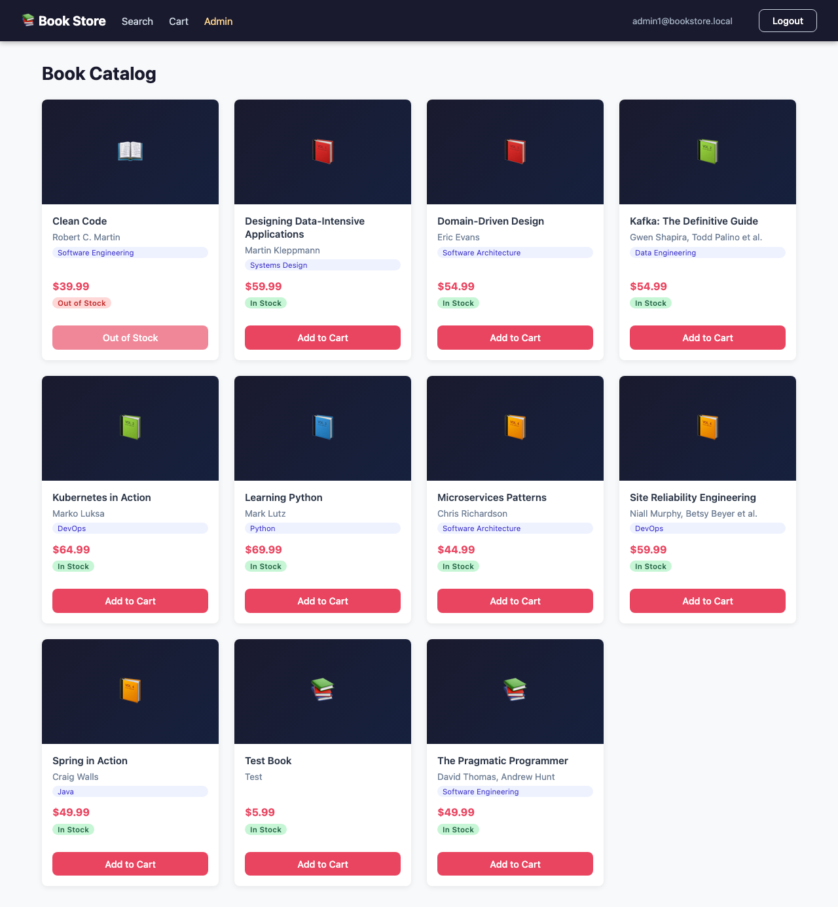

# BookStore Admin Panel — Feature Guide

> **Role required:** `admin` realm role in Keycloak
> **Access URL:** `http://localhost:30000/admin`
> **API base URLs:** `http://api.service.net:30000/ecom/admin` · `http://api.service.net:30000/inven/admin`

---

## Table of Contents

1. [Overview](#overview)
2. [Access Control & Security](#access-control--security)
3. [Logging In as Admin](#logging-in-as-admin)
4. [Admin Dashboard](#admin-dashboard)
5. [Book Management](#book-management)
   - [Viewing All Books](#viewing-all-books)
   - [Adding a New Book](#adding-a-new-book)
   - [Editing a Book](#editing-a-book)
   - [Deleting a Book](#deleting-a-book)
6. [Stock Management](#stock-management)
   - [Viewing Stock Levels](#viewing-stock-levels)
   - [Setting Absolute Quantity](#setting-absolute-quantity)
   - [Adjusting by Delta](#adjusting-by-delta)
7. [Order Management](#order-management)
8. [API Reference (curl)](#api-reference-curl)
9. [What Regular Users See](#what-regular-users-see)

---

## Overview

The Admin Panel is a restricted area of the BookStore UI that allows users with the **`admin`** Keycloak realm role to:

- **Manage the book catalog** — create, update, and delete books
- **Control inventory** — set or adjust stock levels per book
- **Monitor orders** — view all customer orders across the platform

The panel is enforced at three independent layers:

| Layer | Mechanism | Effect |
|-------|-----------|--------|
| **UI** | `AdminRoute` component reads `roles` from JWT | Non-admin users see "Access Denied"; unauthenticated users are redirected to login |
| **E-Commerce API** | `@PreAuthorize("hasRole('ADMIN')")` on all admin controllers | Returns `403 Forbidden` for customer tokens, `401 Unauthorized` for no token |
| **Inventory API** | `require_role("admin")` FastAPI dependency | Returns `403 Forbidden` for customer tokens or missing/invalid tokens |

---

## Access Control & Security

### User Accounts

| Username | Role(s) | Access |
|----------|---------|--------|
| `admin1` | `admin` + `customer` | Full admin panel + shopping |
| `user1` | `customer` | Shopping only — no admin access |

### How Roles Work

Keycloak issues JWT access tokens containing a `roles` claim (array of strings):

```json
{
  "sub": "...",
  "roles": ["admin", "customer"],
  ...
}
```

The `admin` role is a **Keycloak realm role** — it is not tied to any specific client. Both backend services read the `roles` claim from the validated JWT.

### What Happens When a Non-Admin Tries to Access Admin Areas

**Via UI:**
- Unauthenticated user navigates to `/admin` → automatically redirected to login page
- Logged-in customer (`user1`) navigates to `/admin` → shown "Access Denied" red banner

**Via API:**
- Customer token on `GET /ecom/admin/books` → `403 Forbidden`
- No token on `GET /ecom/admin/books` → `401 Unauthorized`
- Customer token on `GET /inven/admin/stock` → `403 Forbidden`

---

## Logging In as Admin

### Step 1 — Navigate to the store

Open `http://localhost:30000` in your browser.

### Step 2 — Log in

Click **Login** in the top-right corner. On the Keycloak login page, enter:

- **Username:** `admin1`
- **Password:** `CHANGE_ME`

### Step 3 — Verify the Admin link appears

After successful login, the navigation bar shows a gold **"Admin"** link between the Cart and your email address:



> The gold "Admin" link is only rendered when the authenticated user's JWT contains the `admin` role. Regular `user1` customers never see this link.

---

## Admin Dashboard

Navigate to `http://localhost:30000/admin` or click the **Admin** link in the navbar.


### Dashboard Stats

The dashboard displays four live stat cards fetched from the APIs on load:

| Card | Source | Description |
|------|--------|-------------|
| **Total Books** | `GET /ecom/admin/books` | Total number of books in the catalog (`totalElements`) |
| **Total Orders** | `GET /ecom/admin/orders` | Total number of orders placed across all users |
| **Low Stock** | `GET /inven/admin/stock` | Count of books with `available` between 1 and 3 (inclusive) |
| **Out of Stock** | `GET /inven/admin/stock` | Count of books with `available = 0` |

### Quick Actions

Four shortcut cards navigate to each admin sub-page:

| Action | Route |
|--------|-------|
| Manage Books | `/admin/books` |
| Add New Book | `/admin/books/new` |
| Manage Stock | `/admin/stock` |
| View Orders | `/admin/orders` |

---

## Book Management

### Viewing All Books

Navigate to `/admin/books` or click **Manage Books** on the dashboard.


The table shows all books with columns:

| Column | Description |
|--------|-------------|
| **Title** | Book title |
| **Author** | Author name(s) |
| **Genre** | Genre category |
| **Price** | Price in USD |
| **ISBN** | ISBN-13 if set, otherwise `—` |
| **Actions** | Edit and Delete buttons per row |

- The subtitle shows the total count (e.g., "11 books total")
- **+ Add Book** button in the top-right navigates to the create form
- **← Dashboard** button returns to the dashboard

---

### Adding a New Book

Click **+ Add Book** from the books list, or navigate directly to `/admin/books/new`.


**Form fields:**

| Field | Required | Validation | Description |
|-------|----------|------------|-------------|
| **Title** | Yes | Non-empty | Book title |
| **Author** | Yes | Non-empty | Author name(s) |
| **Price (USD)** | Yes | ≥ $0.01 | Sale price |
| **Genre** | No | — | Genre category (e.g., "Fantasy", "DevOps") |
| **ISBN** | No | — | ISBN-13 format recommended |
| **Published Year** | No | Integer | Year of publication |
| **Cover URL** | No | URL string | Link to cover image |
| **Description** | No | — | Multi-line synopsis |

Click **Create Book** to submit. The API returns `201 Created` with the new book object including its generated UUID. You are redirected back to the books list on success.

Click **Cancel** to discard and return to the books list.

**Curl equivalent:**
```bash
TOKEN=$(curl -s -X POST \
  "http://idp.keycloak.net:30000/realms/bookstore/protocol/openid-connect/token" \
  -H "Content-Type: application/x-www-form-urlencoded" \
  -d "grant_type=password&client_id=ui-client&username=admin1&password=CHANGE_ME" \
  | python3 -c "import sys,json; print(json.load(sys.stdin)['access_token'])")

curl -X POST "http://api.service.net:30000/ecom/admin/books" \
  -H "Authorization: Bearer $TOKEN" \
  -H "Content-Type: application/json" \
  -d '{
    "title": "Clean Architecture",
    "author": "Robert C. Martin",
    "price": 44.99,
    "genre": "Software Engineering",
    "isbn": "978-0134494166",
    "publishedYear": 2017,
    "description": "A craftsman guide to software structure and design."
  }'
```

---

### Editing a Book

From the books list, click **Edit** on any row. The same form loads in edit mode, pre-populated with the existing values.

- The page title changes to **"Edit Book"** and the submit button says **"Update Book"**
- Submitting sends `PUT /ecom/admin/books/{id}` and returns `200 OK`
- All fields (including optional ones) are sent on update; leave unchanged fields as-is

**Curl equivalent:**
```bash
BOOK_ID="00000000-0000-0000-0000-000000000001"

curl -X PUT "http://api.service.net:30000/ecom/admin/books/$BOOK_ID" \
  -H "Authorization: Bearer $TOKEN" \
  -H "Content-Type: application/json" \
  -d '{
    "title": "The Fellowship of the Ring",
    "author": "J.R.R. Tolkien",
    "price": 14.99,
    "genre": "Fantasy",
    "description": "Updated synopsis here."
  }'
```

---

### Deleting a Book

From the books list, click **Delete** on any row. A browser confirmation dialog appears:

```
Are you sure you want to delete "<Book Title>"?
```

Click **OK** to confirm. The API sends `DELETE /ecom/admin/books/{id}` and returns `204 No Content`. The book is removed from the list immediately.

> **Note:** Deleting a book does not automatically remove its inventory record. Remove the stock entry separately if needed.

**Curl equivalent:**
```bash
curl -X DELETE "http://api.service.net:30000/ecom/admin/books/$BOOK_ID" \
  -H "Authorization: Bearer $TOKEN"
# Returns 204 No Content on success
# Returns 404 Not Found if book doesn't exist
```

---

## Stock Management

### Viewing Stock Levels

Navigate to `/admin/stock` or click **Manage Stock** on the dashboard.


The table shows every book's inventory record with:

| Column | Description |
|--------|-------------|
| **Book** | Book title + first 8 chars of UUID |
| **Total Qty** | Total physical units in warehouse |
| **Reserved** | Units locked by in-progress orders |
| **Available** | `Total Qty − Reserved` — what customers can buy |
| **Status** | Color-coded badge (see below) |
| **Actions** | Set Qty / ± Adjust buttons |

**Status badge thresholds:**

| `available` | Badge | Color |
|-------------|-------|-------|
| `0` | Out of Stock | Red |
| `1–3` | Only X left | Orange |
| `≥ 4` | In Stock | Green |

---

### Setting Absolute Quantity

Click **Set Qty** on any row. An inline input appears with placeholder "new qty":

1. Enter the new total quantity (e.g., `100`)
2. Click the **✓** checkmark button to save
3. Click **✕** to cancel without saving

This sends `PUT /inven/admin/stock/{book_id}` with `{"quantity": 100}`. The operation **resets `reserved` to 0** and sets `available = quantity`. Use this for restocking events (new shipment arriving, manual inventory count correction).

**Curl equivalent:**
```bash
curl -X PUT "http://api.service.net:30000/inven/admin/stock/00000000-0000-0000-0000-000000000001" \
  -H "Authorization: Bearer $TOKEN" \
  -H "Content-Type: application/json" \
  -d '{"quantity": 100}'

# Response:
# {
#   "book_id": "00000000-0000-0000-0000-000000000001",
#   "quantity": 100,
#   "reserved": 0,
#   "available": 100,
#   "updated_at": "2026-03-02T14:30:00Z"
# }
```

---

### Adjusting by Delta

Click **± Adjust** on any row. An inline input appears with placeholder "+/- delta":

1. Enter a positive or negative integer (e.g., `5` to add, `-3` to reduce)
2. Click the **✓** checkmark button to save
3. Click **✕** to cancel

This sends `POST /inven/admin/stock/{book_id}/adjust` with `{"delta": 5}`. The operation adds the delta to the **current quantity** without touching `reserved`. Use this for incremental adjustments (damage write-off, small top-up).

**Curl equivalent:**
```bash
# Add 10 units
curl -X POST "http://api.service.net:30000/inven/admin/stock/00000000-0000-0000-0000-000000000001/adjust" \
  -H "Authorization: Bearer $TOKEN" \
  -H "Content-Type: application/json" \
  -d '{"delta": 10}'

# Remove 3 units (use negative delta)
curl -X POST "http://api.service.net:30000/inven/admin/stock/00000000-0000-0000-0000-000000000001/adjust" \
  -H "Authorization: Bearer $TOKEN" \
  -H "Content-Type: application/json" \
  -d '{"delta": -3}'
```

**Error handling:**
- If the resulting quantity would be negative, the API returns `400 Bad Request` and the stock is unchanged
- Customer tokens receive `403 Forbidden`

**When to use Set Qty vs. ± Adjust:**

| Scenario | Use |
|----------|-----|
| New shipment arrived — set exact new total | **Set Qty** |
| Damaged goods write-off — remove N units | **± Adjust** (negative delta) |
| Manual inventory count correction | **Set Qty** |
| Small restock top-up | **± Adjust** (positive delta) |

---

## Order Management

Navigate to `/admin/orders` or click **View Orders** on the dashboard.


The orders table shows all orders across **all users** (admin-only view):

| Column | Description |
|--------|-------------|
| **Order ID** | UUID (first 8 chars shown) |
| **User ID** | Keycloak subject UUID of the customer |
| **Total** | Order total in USD |
| **Status** | Order status (e.g., `PENDING`) |
| **Created At** | ISO timestamp |
| **Items** | Expand to see line items |

Orders are sorted newest-first. The subtitle shows the total count.

**Expanding order items:** Click the **▶ Items** toggle on any row to reveal the line items for that order (book title, quantity, price at time of purchase).

**Curl equivalent:**
```bash
# List all orders (paginated)
curl "http://api.service.net:30000/ecom/admin/orders?page=0&size=20" \
  -H "Authorization: Bearer $TOKEN"

# Get a specific order with full item detail
curl "http://api.service.net:30000/ecom/admin/orders/<order-uuid>" \
  -H "Authorization: Bearer $TOKEN"
```

---

## API Reference (curl)

### Get admin token

```bash
TOKEN=$(curl -s -X POST \
  "http://idp.keycloak.net:30000/realms/bookstore/protocol/openid-connect/token" \
  -H "Content-Type: application/x-www-form-urlencoded" \
  -d "grant_type=password&client_id=ui-client&username=admin1&password=CHANGE_ME" \
  | python3 -c "import sys,json; print(json.load(sys.stdin)['access_token'])")
```

### E-Commerce Admin — Books

| Method | Path | Description | Success |
|--------|------|-------------|---------|
| `GET` | `/ecom/admin/books` | List all books (paginated) | `200` |
| `GET` | `/ecom/admin/books/{id}` | Get single book | `200` |
| `POST` | `/ecom/admin/books` | Create book | `201 Created` |
| `PUT` | `/ecom/admin/books/{id}` | Update book (full replace) | `200` |
| `DELETE` | `/ecom/admin/books/{id}` | Delete book | `204 No Content` |

**Pagination parameters** (GET list endpoints): `?page=0&size=20`

### E-Commerce Admin — Orders

| Method | Path | Description | Success |
|--------|------|-------------|---------|
| `GET` | `/ecom/admin/orders` | List all orders (paginated, newest-first) | `200` |
| `GET` | `/ecom/admin/orders/{id}` | Get order with line items | `200` |

### Inventory Admin — Stock

| Method | Path | Description | Success |
|--------|------|-------------|---------|
| `GET` | `/inven/admin/stock` | List all stock entries | `200` |
| `PUT` | `/inven/admin/stock/{book_id}` | Set absolute qty (resets reserved=0) | `200` |
| `POST` | `/inven/admin/stock/{book_id}/adjust` | Adjust by signed delta | `200` / `400` if result < 0 |

### Error Responses

| Status | Meaning |
|--------|---------|
| `401 Unauthorized` | No or expired token (E-Commerce Service) |
| `403 Forbidden` | Valid token but lacks `admin` role (both services) |
| `404 Not Found` | Resource does not exist |
| `400 Bad Request` | Validation failure (e.g., stock delta would go negative) |

---

## What Regular Users See

A customer logged in as `user1` (customer role only):

**Navbar** — no "Admin" link is rendered. The navbar shows only: Search · Cart · user1@bookstore.local · Logout

**Direct URL access** — navigating to `http://localhost:30000/admin` renders an "Access Denied" message:
```
Access Denied
You do not have permission to view this page.
```
The user is not redirected; the denial is shown in place so the URL is not leaked.

**API calls with customer token** — all `/ecom/admin/*` and `/inven/admin/*` endpoints return `403 Forbidden`, regardless of which UI path was used to obtain the token.

---

## Keycloak Admin Console

The Keycloak admin console is used to manage users, roles, clients, and realm settings.

### Access URLs

| URL | Notes |
|-----|-------|
| `http://idp.keycloak.net:30000/admin` | Via Istio gateway — available immediately on any running cluster |
| `http://localhost:32400/admin` | Direct NodePort — available after a fresh bootstrap (`up.sh`) |

**Credentials:** `admin` / `CHANGE_ME` (the Keycloak master realm admin, not the bookstore admin1 user)

> **Note:** `admin1` is a bookstore application user (realm: `bookstore`) — it is NOT the Keycloak admin. Use the `admin` / `CHANGE_ME` credentials to log into the Keycloak admin console itself.

### Common Admin Tasks

**View bookstore realm roles:**
`Realm Settings → Roles → admin, customer`

**View bookstore users:**
`Users → user1, admin1`

**View ui-client configuration:**
`Clients → ui-client → Settings` — verify `directAccessGrantsEnabled: true` and `Valid post logout redirect URIs`

**Re-import realm (via script, preserves passwords):**
```bash
bash scripts/keycloak-import.sh
```

---

## Related Documentation

- [API Reference](../api/api-reference.md) — complete REST API docs including admin endpoints
- [Step-by-Step System Setup](step-by-step-system-setup.md) — bring up the full cluster
- [Manual Test Guide](manual-test.md) — exploratory testing checklist
- [Security — mTLS](step-by-step-mtls.md) — how inter-service encryption works
