# Cert Dashboard — User Manual

A step-by-step guide to using the cert-dashboard operator web interface for monitoring and renewing cert-manager TLS certificates.

**Dashboard URL:** `http://localhost:32600`

---

## Table of Contents

1. [Accessing the Dashboard](#1-accessing-the-dashboard)
2. [Understanding the Dashboard Layout](#2-understanding-the-dashboard-layout)
3. [Reading a Certificate Card](#3-reading-a-certificate-card)
4. [Certificate Status Indicators](#4-certificate-status-indicators)
5. [Understanding the Progress Bar](#5-understanding-the-progress-bar)
6. [Identifying CA vs Leaf Certificates](#6-identifying-ca-vs-leaf-certificates)
7. [Certificate Details Reference](#7-certificate-details-reference)
8. [Renewing a Certificate](#8-renewing-a-certificate)
9. [Understanding the Renewal SSE Stream](#9-understanding-the-renewal-sse-stream)
10. [After Renewal — Verifying Changes](#10-after-renewal--verifying-changes)
11. [Using the REST API](#11-using-the-rest-api)
12. [Auto-Refresh Behaviour](#12-auto-refresh-behaviour)
13. [Quick Reference](#13-quick-reference)
14. [FAQ](#14-faq)

---

## 1. Accessing the Dashboard

Open your browser and navigate to:

```
http://localhost:32600
```

The dashboard loads immediately and displays all monitored cert-manager certificates.

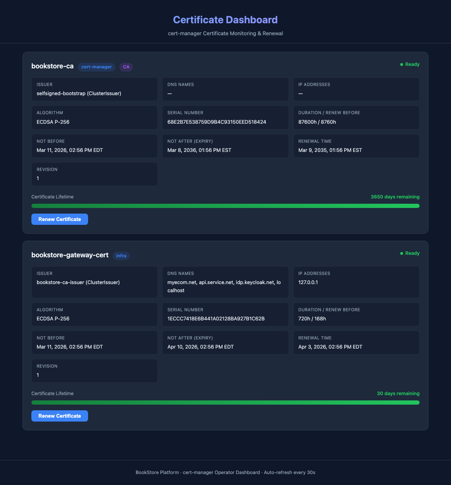

**What you see on first load:**
- A header with the title "Certificate Dashboard"
- One card per certificate managed by cert-manager
- A footer indicating auto-refresh is active

If the page shows "No certificates found", verify that cert-manager is installed and has at least one Certificate resource in the monitored namespaces.

---

## 2. Understanding the Dashboard Layout

The dashboard has three sections:

### Header


- **Title**: "Certificate Dashboard" in gradient blue-purple text
- **Subtitle**: "cert-manager Certificate Monitoring & Renewal"

### Main Content Area

The main area contains **certificate cards** — one per cert-manager `Certificate` resource. Cards are listed in the order they're discovered from the monitored Kubernetes namespaces.

### Footer


- Shows "BookStore Platform - cert-manager Operator Dashboard - Auto-refresh every 30s"
- Data refreshes automatically every 30 seconds without a page reload

---

## 3. Reading a Certificate Card

Each certificate card contains all the information you need at a glance.

### Gateway Certificate Example

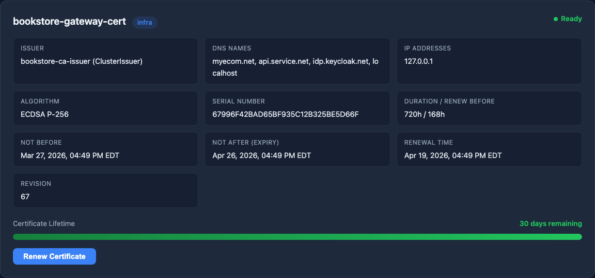

A card has four sections from top to bottom:

| Section | Content |
|---------|---------|
| **Header Row** | Certificate name, namespace badge, Ready indicator |
| **Details Grid** | 10 metadata fields in a responsive 3-column grid |
| **Progress Bar** | Visual lifetime indicator with days remaining |
| **Actions** | Renew button (and SSE panel during renewal) |

### CA Certificate Example


CA certificates look the same but include an additional purple **CA** badge and typically have a much longer lifetime (e.g., 3650 days for a 10-year CA).

---

## 4. Certificate Status Indicators

### Ready Status


Every card shows a status indicator in the top-right corner:

| Indicator | Meaning |
|-----------|---------|
| **Green dot + "Ready"** | Certificate is valid and the TLS secret exists |
| **Red dot + "Not Ready"** | Certificate is being issued, or has an error |

A "Not Ready" state is normal during renewal (typically lasts 2-10 seconds). If it persists, check cert-manager logs.

### CA Badge


CA (Certificate Authority) certificates are identified by a purple **CA** badge next to the namespace. These are root or intermediate certificates used to sign other certificates. You typically should **not** renew a CA certificate unless you understand the impact on all leaf certificates it has signed.

---

## 5. Understanding the Progress Bar

The progress bar provides a visual representation of the certificate's remaining lifetime.

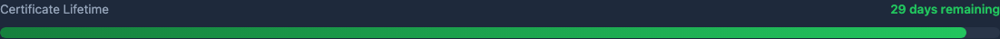

### Color Coding

| Color | Condition | Action Required |
|-------|-----------|-----------------|
| **Green** | More than 10 days remaining | None — certificate is healthy |
| **Yellow** | 10 days or fewer remaining | Plan a renewal soon |
| **Red** | 5 days or fewer remaining | Renew immediately |

### How to Read It

- **Width**: Percentage of total lifetime remaining (100% = full bar = just issued)
- **Label**: "Certificate Lifetime" on the left
- **Days counter**: "X days remaining" on the right, colored to match the bar

**Example:** A 30-day certificate with 30 days remaining shows a full green bar. At 10 days remaining, it turns yellow and the bar is approximately 33% filled. At 5 days, it turns red.

> **Note:** cert-manager automatically renews certificates before expiry (controlled by the `renewBefore` field, typically 7 days). The progress bar helps you visually confirm that auto-renewal is working.

---

## 6. Identifying CA vs Leaf Certificates

| Feature | CA Certificate | Leaf Certificate |
|---------|---------------|------------------|
| **CA badge** | Purple "CA" badge visible | No CA badge |
| **Issuer** | `selfsigned-bootstrap` (self-signed) | `bookstore-ca-issuer` (signed by CA) |
| **Lifetime** | Very long (e.g., 87600h = 10 years) | Short (e.g., 720h = 30 days) |
| **DNS Names** | Usually none (dash "—") | Lists all covered hostnames |
| **IP Addresses** | Usually none | May include 127.0.0.1 |
| **Renewal risk** | HIGH — breaks all leaf certs | LOW — only affects this cert |

**Rule of thumb:** Only renew leaf certificates through the dashboard. CA renewal should be planned carefully.

---

## 7. Certificate Details Reference

The details grid shows 10 fields:

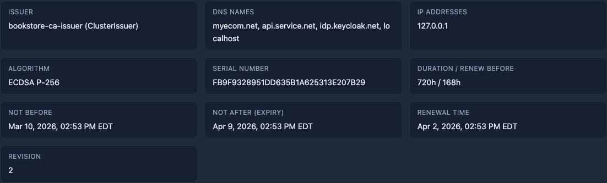

| Field | Description | Example |
|-------|-------------|---------|
| **Issuer** | Who signed this certificate (name + kind) | `bookstore-ca-issuer (ClusterIssuer)` |
| **DNS Names** | Hostnames the certificate covers | `myecom.net, api.service.net, idp.keycloak.net, localhost` |
| **IP Addresses** | IP addresses the certificate covers | `127.0.0.1` |
| **Algorithm** | Cryptographic algorithm and key size | `ECDSA P-256` |
| **Serial Number** | Unique hex identifier from the X.509 certificate | `999A5CD56B64C9B2E7D92943B054BA73` |
| **Duration / Renew Before** | Total lifetime / how early to auto-renew | `720h / 168h` (30 days / 7 days before expiry) |
| **Not Before** | When the certificate became valid | `Mar 10, 2026, 01:45 PM EDT` |
| **Not After (Expiry)** | When the certificate expires | `Apr 9, 2026, 01:45 PM EDT` |
| **Renewal Time** | When cert-manager plans to auto-renew | `Apr 2, 2026, 01:45 PM EDT` |
| **Revision** | How many times this certificate has been issued | `21` (increments on each renewal) |

### Key Fields Explained

- **Duration / Renew Before**: `720h / 168h` means the cert lasts 30 days and cert-manager will auto-renew 7 days before expiry (at day 23).
- **Revision**: Starts at 1 on first issuance. Each renewal increments by 1. A revision of 21 means the certificate has been renewed 20 times.
- **Serial Number**: Changes on every renewal. Useful for verifying that a renewal actually produced a new certificate.
- **Renewal Time**: The date cert-manager will automatically renew. This is calculated as `Not After - Renew Before`.

---

## 8. Renewing a Certificate

### Step 1: Click the Renew Button


Find the certificate card you want to renew and click the blue **"Renew Certificate"** button at the bottom.

> The button is disabled (grayed out) if the certificate is not in a Ready state.

### Step 2: Review the Confirmation Modal

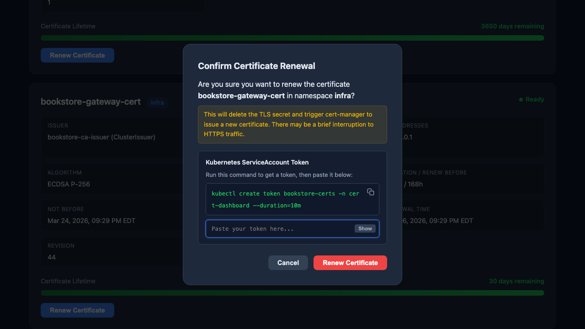

A confirmation dialog appears with:
- The certificate name and namespace
- A yellow warning explaining what will happen

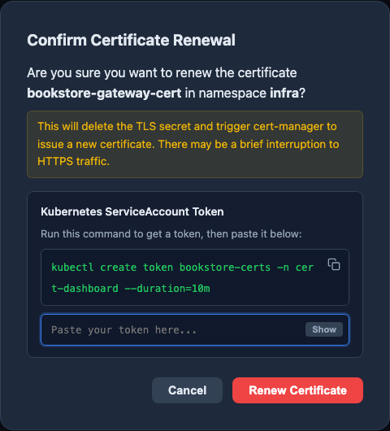

**Read the warning carefully:**

> "This will delete the TLS secret and trigger cert-manager to issue a new certificate. There may be a brief interruption to HTTPS traffic."

### Step 3: Confirm or Cancel

| Button | Action |
|--------|--------|
| **Cancel** (gray) | Closes the modal, no changes made |
| **Renew Certificate** (red) | Triggers the renewal process |

### What Happens When You Confirm

1. The modal closes
2. The Renew button becomes disabled (prevents double-click)
3. An SSE (Server-Sent Events) panel appears below the button
4. The dashboard deletes the TLS secret from Kubernetes
5. cert-manager detects the missing secret and starts re-issuance
6. Progress updates stream live to your browser

---

## 9. Understanding the Renewal SSE Stream

After confirming a renewal, a dark panel appears below the certificate card showing real-time progress:

### In-Progress View

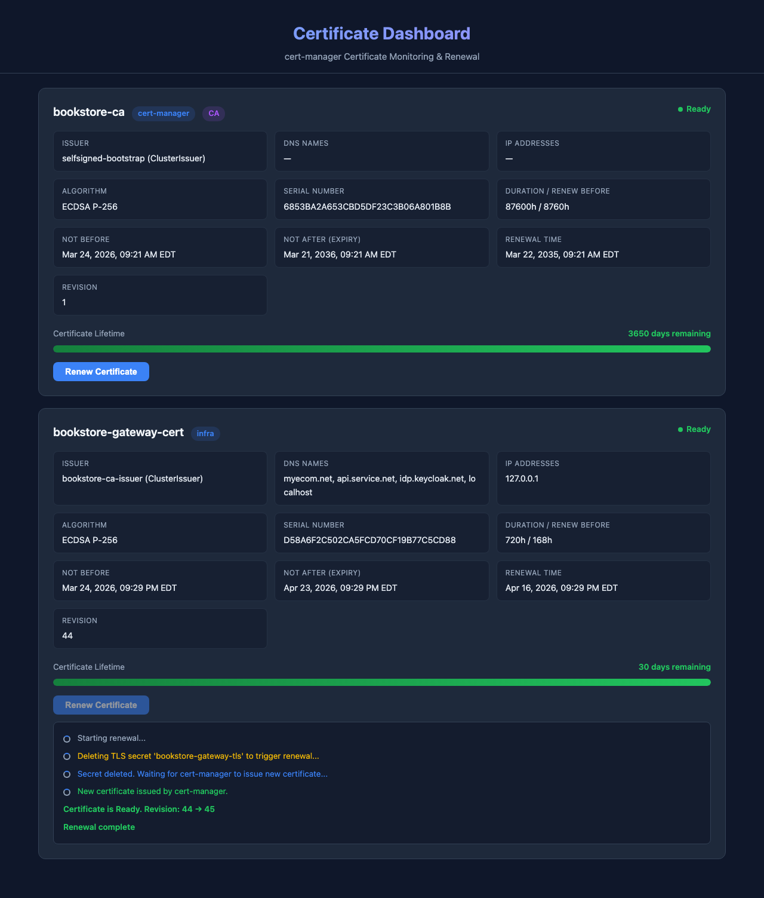

### Completed View

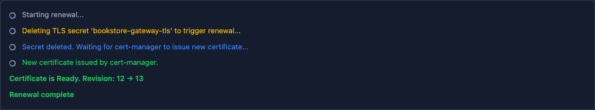

### Phase-by-Phase Breakdown

| # | Phase | Icon | Color | Message | What's Happening |
|---|-------|------|-------|---------|------------------|
| 1 | Start | Spinner | Gray | "Starting renewal..." | Dashboard is preparing |
| 2 | `deleting-secret` | Spinner | Yellow | "Deleting TLS secret 'X' to trigger renewal..." | TLS secret is being deleted from Kubernetes |
| 3 | `waiting-issuing` | Spinner | Blue | "Secret deleted. Waiting for cert-manager to issue new certificate..." | cert-manager detected the missing secret and is requesting a new one from the issuer |
| 4 | `issued` | Spinner | Green | "New certificate issued by cert-manager." | The issuer has signed a new certificate |
| 5 | `ready` | None | **Green bold** | "Certificate is Ready. Revision: 20 -> 21" | The new certificate is stored in a secret and the Certificate resource is Ready |
| 6 | `complete` | None | **Green bold** | "Renewal complete" | Process finished successfully |

### Timing

- **Typical duration**: 2-5 seconds for the entire renewal
- **Maximum timeout**: 60 seconds (if cert-manager is slow to issue)
- **HTTPS interruption**: Momentary (< 1 second) while the old secret is deleted and the new one is created

### Error Handling

If any step fails, you'll see a red error message:

| Error | Likely Cause |
|-------|-------------|
| "Failed to get current revision" | Dashboard can't read the Certificate resource — check RBAC |
| "Failed to delete secret" | Dashboard doesn't have delete permission on the secret |
| "Timeout waiting for certificate" | cert-manager didn't issue within 60s — check cert-manager logs |

---

## 10. After Renewal — Verifying Changes

### Immediate View (SSE Panel Still Visible)

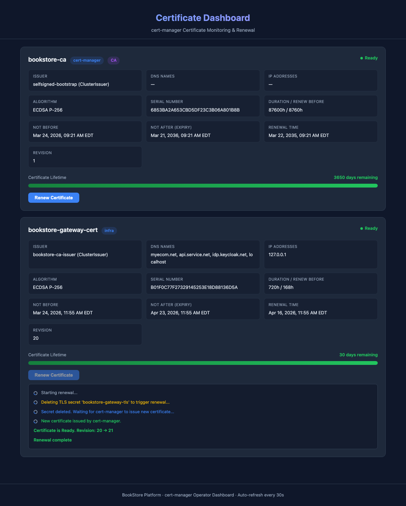

The SSE panel stays visible for about 10 seconds so you can review the log.

### Refreshed View (Updated Certificate Data)


After the auto-refresh, the certificate card updates with:

| Field | What Changed |
|-------|-------------|
| **Serial Number** | New hex value (every certificate gets a unique serial) |
| **Not Before** | Updated to the renewal timestamp |
| **Not After** | Extended by the certificate's duration (e.g., +30 days) |
| **Renewal Time** | Recalculated based on new Not After |
| **Revision** | Incremented by 1 (e.g., 20 -> 21) |
| **Progress Bar** | Full green (100% lifetime remaining) |

### Verify HTTPS Still Works

After renewing a gateway certificate, verify that HTTPS endpoints are still functional:

```bash
curl -sk https://api.service.net:30000/ecom/books | head -c 100
```

Expected: HTTP 200 with JSON response.

---

## 11. Using the REST API

The dashboard exposes a REST API for programmatic access and automation.

### Health Check

```bash
curl http://localhost:32600/healthz
```

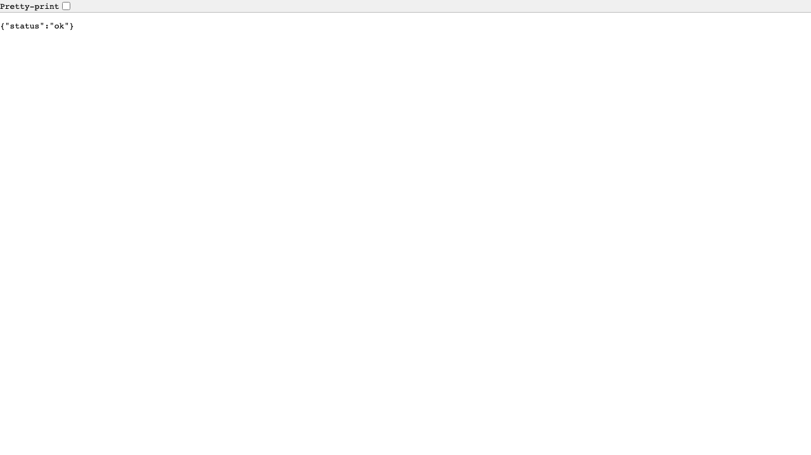

**Response:** `{"status":"ok"}`

Use this endpoint for Kubernetes liveness/readiness probes or external monitoring.

### List All Certificates

```bash
curl -s http://localhost:32600/api/certs | python3 -m json.tool
```

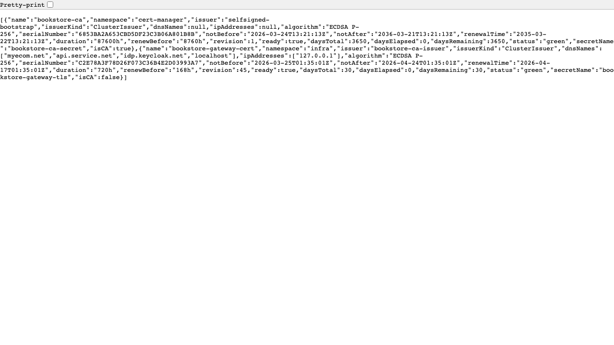

**Response:** JSON array of certificate objects with all fields shown in the dashboard cards.

**Example response structure:**
```json
[
  {
    "name": "bookstore-gateway-cert",
    "namespace": "infra",
    "issuer": "bookstore-ca-issuer",
    "issuerKind": "ClusterIssuer",
    "dnsNames": ["myecom.net", "api.service.net", "idp.keycloak.net", "localhost"],
    "ipAddresses": ["127.0.0.1"],
    "algorithm": "ECDSA P-256",
    "serialNumber": "999A5CD56B64C9B2E7D92943B054BA73",
    "notBefore": "2026-03-10T17:45:00Z",
    "notAfter": "2026-04-09T17:45:00Z",
    "renewalTime": "2026-04-02T17:45:00Z",
    "duration": "720h",
    "renewBefore": "168h",
    "revision": 21,
    "ready": true,
    "daysTotal": 30,
    "daysElapsed": 0,
    "daysRemaining": 30,
    "status": "green",
    "secretName": "bookstore-gateway-tls",
    "isCA": false
  }
]
```

### Prometheus Metrics

```bash
curl -s http://localhost:32600/metrics
```

**Response:** Prometheus exposition format with certificate counts, days remaining, ready status, and renewal counters.

### Trigger Renewal via API

> **Authentication required:** The renew endpoint requires a valid Kubernetes ServiceAccount token. Pass it as a Bearer token in the `Authorization` header.

```bash
# Get a ServiceAccount token
TOKEN=$(kubectl create token bookstore-certs -n cert-dashboard)

curl -s -X POST http://localhost:32600/api/renew \
  -H 'Content-Type: application/json' \
  -H "Authorization: Bearer $TOKEN" \
  -d '{"name":"bookstore-gateway-cert","namespace":"infra"}'
```

**Response:**
```json
{"streamId":"505c9948-be50-436b-8724-aab86bac4d8c"}
```

### Subscribe to Renewal Stream

```bash
curl -sN http://localhost:32600/api/sse/<streamId>
```

**Response** (Server-Sent Events format):
```
: keepalive

event: status
data: {"event":"status","phase":"deleting-secret","message":"Deleting TLS secret..."}

event: status
data: {"event":"status","phase":"waiting-issuing","message":"Secret deleted..."}

event: status
data: {"event":"status","phase":"issued","message":"New certificate issued..."}

event: status
data: {"event":"status","phase":"ready","message":"Certificate is Ready. Revision: 20 → 21"}

event: complete
data: {"event":"complete","message":"Renewal complete","done":true}
```

### API Error Responses

| Endpoint | Status | Body | Cause |
|----------|--------|------|-------|
| `POST /api/renew` | 400 | `{"error":"name and namespace required"}` | Empty name or namespace |
| `POST /api/renew` | 401 | `Unauthorized` | Missing or invalid Bearer token |
| `POST /api/renew` | 404 | `{"error":"certificate not found"}` | Certificate doesn't exist in monitored namespaces |
| `POST /api/renew` | 429 | `Too Many Requests` | Rate limit exceeded (1 per 10 seconds) |
| `GET /api/sse/{id}` | 404 | `stream not found` | Invalid or expired stream ID |

---

## 12. Auto-Refresh Behaviour

The dashboard refreshes certificate data automatically:

| Trigger | Interval | Condition |
|---------|----------|-----------|
| **Background poll** | Every 30 seconds | Only when no SSE panel is active |
| **After renewal** | 10 seconds after completion | SSE panel clears and fresh data loads |
| **Watcher (server-side)** | Every 15 seconds | Dashboard backend polls Kubernetes API |

**Important:** Auto-refresh does NOT cause a full page reload. Only the certificate data is fetched and re-rendered. If you're viewing an SSE renewal stream, the refresh is paused to avoid disrupting the live view.

---

## 13. Quick Reference

### URLs

| URL | Purpose |
|-----|---------|
| `http://localhost:32600` | Dashboard UI |
| `http://localhost:32600/healthz` | Health check |
| `http://localhost:32600/api/certs` | Certificate list (JSON) |
| `http://localhost:32600/api/renew` | Trigger renewal (POST, auth required) |
| `http://localhost:32600/api/sse/{id}` | Renewal SSE stream |
| `http://localhost:32600/metrics` | Prometheus metrics |

### kubectl Commands

```bash
# Check dashboard pod
kubectl get pods -n cert-dashboard -l app=cert-dashboard

# Check operator pod
kubectl get pods -n cert-dashboard -l app=cert-dashboard-operator

# View CR status
kubectl get certdashboard -n cert-dashboard

# Dashboard logs
kubectl logs -n cert-dashboard -l app=cert-dashboard --tail=50

# Operator logs
kubectl logs -n cert-dashboard -l app=cert-dashboard-operator --tail=50

# List cert-manager certificates
kubectl get certificates --all-namespaces
```

### Progress Bar Color Thresholds

| Days Remaining | Color | Urgency |
|---------------|-------|---------|
| > 10 | Green | No action needed |
| 6 - 10 | Yellow | Renewal approaching |
| 0 - 5 | Red | Renewal overdue or imminent |

### Renewal Impact

| Certificate Type | Impact of Renewal | Downtime |
|-----------------|-------------------|----------|
| **Leaf (gateway)** | Brief HTTPS interruption (< 1 second) | Minimal |
| **CA** | All leaf certs signed by this CA become untrusted | **Significant** |

---

## 14. FAQ

### Q: How often does cert-manager auto-renew certificates?

cert-manager renews certificates automatically based on the `renewBefore` field. For a certificate with `duration: 720h` (30 days) and `renewBefore: 168h` (7 days), cert-manager will auto-renew at day 23 — you don't need to click Renew manually.

The dashboard's Renew button is for **forced on-demand renewal** when you need a new certificate immediately (e.g., after a key compromise or configuration change).

### Q: Will renewing a certificate break my application?

For **leaf certificates** (like `bookstore-gateway-cert`): there may be a momentary HTTPS interruption (< 1 second) while the old secret is deleted and the new one is created. Active connections using the old certificate will continue to work until they're closed.

For **CA certificates**: **yes** — renewing a CA invalidates all leaf certificates signed by it. Do not renew CA certificates through the dashboard unless you plan to re-issue all leaf certificates afterward.

### Q: What does "Revision: 20 -> 21" mean?

The revision number tracks how many times cert-manager has issued this certificate. `20 -> 21` means this was the 21st issuance. The number increments by 1 on each successful renewal.

### Q: The progress bar is red — is the certificate expired?

Not necessarily. Red means **5 days or fewer** remain. cert-manager should auto-renew before expiry (based on `renewBefore`). If the bar is red and the certificate shows "Ready", check the `Renewal Time` field — cert-manager may be about to renew.

If the certificate is **Not Ready** and red, check cert-manager logs:
```bash
kubectl logs -n cert-manager deploy/cert-manager --tail=50
```

### Q: Can I use the API to build automated monitoring?

Yes. Poll `GET /api/certs` and check the `status` and `daysRemaining` fields:

```bash
# Alert if any certificate has fewer than 7 days remaining
curl -s http://localhost:32600/api/certs | \
  python3 -c "
import sys, json
certs = json.load(sys.stdin)
for c in certs:
    if c['daysRemaining'] < 7:
        print(f\"ALERT: {c['name']} in {c['namespace']} has {c['daysRemaining']} days remaining\")
"
```

### Q: The dashboard shows "No certificates found"

Check:
1. cert-manager is installed: `kubectl get pods -n cert-manager`
2. Certificates exist: `kubectl get certificates --all-namespaces`
3. The CertDashboard CR monitors the right namespaces:
   ```bash
   kubectl get certdashboard -n cert-dashboard -o jsonpath='{.items[0].spec.namespaces}'
   ```
4. Dashboard RBAC allows reading certificates:
   ```bash
   kubectl auth can-i list certificates.cert-manager.io \
     --as=system:serviceaccount:cert-dashboard:bookstore-certs \
     -n infra
   ```

### Q: Can I change the threshold days for yellow/red?

Yes. Edit the CertDashboard CR:

```bash
kubectl edit certdashboard bookstore-certs -n cert-dashboard
```

Change:
```yaml
spec:
  yellowThresholdDays: 14   # was 10
  redThresholdDays: 7       # was 5
```

The operator will update the dashboard deployment with the new thresholds.

### Q: How do I add more namespaces to monitor?

Edit the CertDashboard CR and add namespaces to the `spec.namespaces` array:

```bash
kubectl patch certdashboard bookstore-certs -n cert-dashboard \
  --type=json -p='[{"op":"add","path":"/spec/namespaces/-","value":"my-new-namespace"}]'
```

### Q: Why does POST /api/renew return 401?

The renew endpoint requires a valid Kubernetes ServiceAccount token in the `Authorization` header. Obtain a token and include it as a Bearer token:

```bash
TOKEN=$(kubectl create token bookstore-certs -n cert-dashboard)
curl -s -X POST http://localhost:32600/api/renew \
  -H "Authorization: Bearer $TOKEN" \
  -H 'Content-Type: application/json' \
  -d '{"name":"bookstore-gateway-cert","namespace":"infra"}'
```

### Q: Why does POST /api/renew return 429?

Rate limiting allows only one renewal every 10 seconds. Wait at least 10 seconds after the previous renewal request and try again.

### Q: The SSE stream shows "SSE connection lost"

This usually means:
- A reverse proxy or load balancer timed out the SSE connection
- The dashboard pod restarted during renewal
- Network interruption between browser and cluster

The renewal may still have succeeded. Refresh the page to check the current certificate state.
