# Book Store — Complete Product Documentation

> **Generated:** 2026-03-01 · **E2E Tests:** 89/89 passed · **Screenshots:** 90+ images
> **Stack:** React 19.2 · Spring Boot 4.0 · FastAPI · Kafka KRaft · Debezium · Apache Flink 1.20 · Superset · Keycloak 26.5.4 · Istio Ambient Mesh

---

## Table of Contents

1. [Infrastructure Architecture](#1-infrastructure-architecture)
2. [Animated Data Flow](#2-animated-data-flow)
3. [Kiali — Service Mesh Visualisation](#3-kiali--service-mesh-visualisation)
4. [Authentication & Security (Keycloak)](#4-authentication--security-keycloak)
5. [API Endpoints](#5-api-endpoints)
6. [Book Catalog](#6-book-catalog)
7. [Search](#7-search)
8. [Shopping Cart — Guest & Authenticated](#8-shopping-cart--guest--authenticated)
9. [Checkout & Order Placement](#9-checkout--order-placement)
10. [CDC Pipeline — Analytics Sync](#10-cdc-pipeline--analytics-sync)
11. [Analytics Dashboard — Apache Superset](#11-analytics-dashboard--apache-superset)
12. [Database Administration — PgAdmin](#12-database-administration--pgadmin)
13. [E2E Test Suite Summary](#13-e2e-test-suite-summary)
14. [Manual Test Guideline](#14-manual-test-guideline)

---

## 1. Infrastructure Architecture

The platform runs on a local 3-node **kind** Kubernetes cluster with **Istio Ambient Mesh** for mTLS encryption across all services.

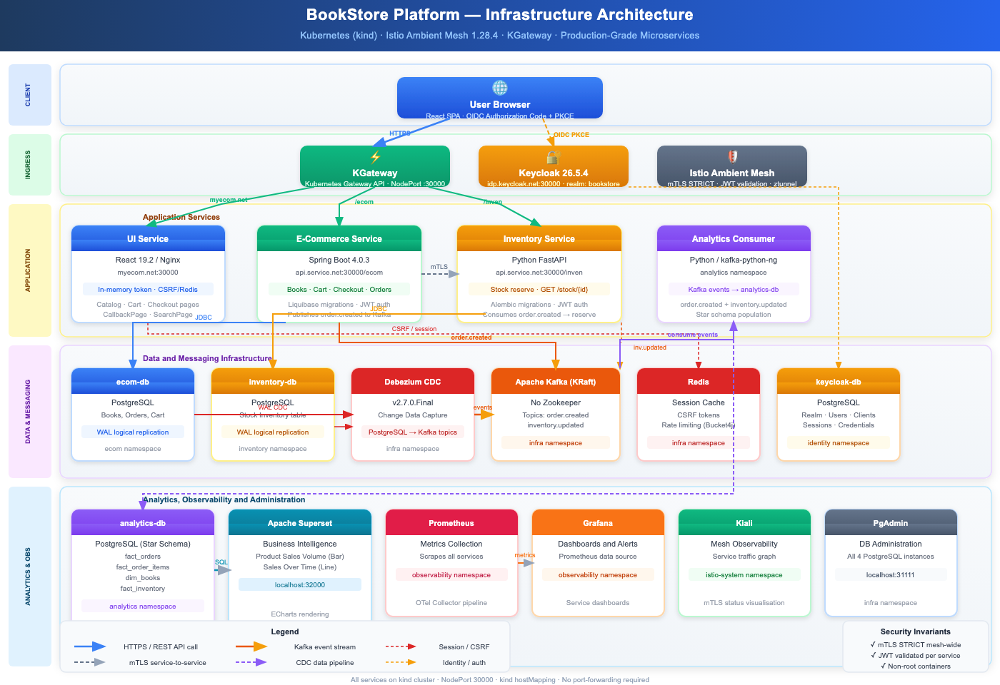

### Key Components

| Component | Technology | Namespace | Exposed |
|-----------|-----------|-----------|---------|
| UI Service | React 19.2 / Vite / Nginx | `ecom` | `myecom.net:30000` |
| E-Commerce API | Spring Boot 4.0.3 (Java) | `ecom` | `api.service.net:30000/ecom` |
| Inventory API | Python FastAPI + AIOKafka | `inventory` | `api.service.net:30000/inven` |
| Identity Provider | Keycloak 26.5.4 | `identity` | `idp.keycloak.net:30000` |
| Message Broker | Kafka KRaft (no Zookeeper) | `infra` | internal |
| CDC Connector | Debezium 2.7.0.Final | `infra` | internal |
| Analytics Pipeline | Apache Flink 1.20 (4 SQL streaming jobs) | `analytics` | `localhost:32200` (Flink UI) |
| Analytics DB | PostgreSQL (star schema, 10 views) | `analytics` | internal |
| Analytics Dashboard | Apache Superset (3 dashboards, 16 charts) | `analytics` | `localhost:32000` |
| Service Mesh | Istio Ambient Mesh 1.28.4 | `istio-system` | — |
| Gateway | Istio Gateway (k8s Gateway API) | `infra` | all :30000 routes |
| Session / Rate-limit | Redis | `infra` | internal |
| DB Admin | PgAdmin 4 | `infra` | `localhost:31111` |
| Mesh Visualiser | Kiali | `istio-system` | `localhost:32100` |

---

## 2. Animated Data Flow

The animated diagram shows live events flowing through the CDC pipeline from user order placement to Superset analytics.

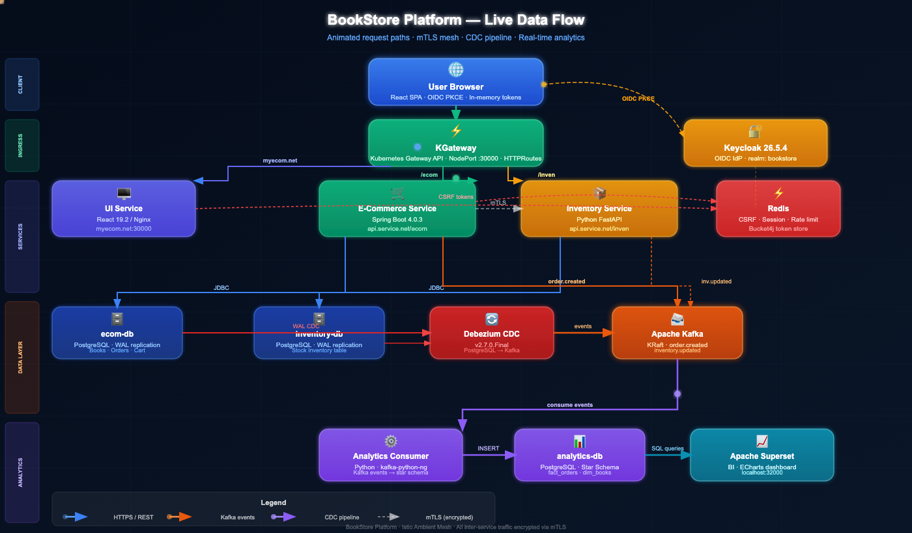

> The SVG source at `docs/diagrams/data-flow-animated.svg` contains CSS animations. Open it in a browser to see packets animate along each path.

### Data Pipeline Stages

```
User places order
    │
    ▼  POST /ecom/checkout (< 100ms)
E-Commerce API → mTLS reserve call → Inventory Service
               → publishes order.created to Kafka
    │
    ▼  Debezium WAL CDC (< 500ms)
ecom-db.public.orders      → Kafka: ecom-connector.public.orders
ecom-db.public.order_items → Kafka: ecom-connector.public.order_items
inventory-db.public.inventory → Kafka: inventory-connector.public.inventory
    │
    ▼  Apache Flink SQL (< 2s) — 4 continuous streaming jobs
Kafka (plain json, after ROW extraction) → JDBC upsert → analytics-db
    • fact_orders · fact_order_items · dim_books · fact_inventory
    │
    ▼  Superset SQL (on demand) — 3 dashboards, 16 charts, 10 views
SELECT * FROM vw_product_sales_volume   →  ECharts bar chart
SELECT * FROM vw_inventory_health       →  Table (sorted by available)
SELECT * FROM vw_book_price_distribution →  Pie chart
... (10 views total)

Total end-to-end latency: < 5 seconds
```

---

## 3. Kiali — Service Mesh Visualisation

Kiali provides real-time service topology, traffic metrics, and health status for all Istio-managed services.
Kiali is exposed via **NodePort 32100** — accessible at **`http://localhost:32100/kiali`** through a Docker proxy container in the kind network.

### 3.1 Kiali Overview


---

### 3.2 Service Graph

The graph view shows inter-service traffic with mTLS padlock icons on all connections.


---

### 3.3 Workloads

All deployments across namespaces (`ecom`, `inventory`, `analytics`, `identity`, `infra`) are listed with health status.


---

### 3.4 Services

All Kubernetes Services with mTLS status indicators.


---

### 3.5 Mesh Topology

Full ambient mesh topology showing ztunnel data plane and control plane interconnections.


**Accessing Kiali:**

Kiali is exposed via **NodePort 32100** through a Docker proxy container (`kiali-proxy`) running in the kind network — **no `kubectl port-forward` required.**

```
http://localhost:32100/kiali
```

```bash
# If the kiali-proxy container is not running (e.g. after cluster recreation):
CTRL_IP=$(kubectl get node bookstore-control-plane \
  -o jsonpath='{.status.addresses[?(@.type=="InternalIP")].address}')
docker rm -f kiali-proxy 2>/dev/null
docker run -d --name kiali-proxy \
  --network kind --restart unless-stopped \
  -p 32100:32100 \
  alpine/socat TCP-LISTEN:32100,fork,reuseaddr TCP:${CTRL_IP}:32100
```

**Prometheus connection** is bridged via an ExternalName Service in `istio-system` pointing to `prometheus.observability`. Kiali's traffic graph shows L4 TCP metrics (`istio_tcp_connections_*`) from ztunnel; no L7 metrics because no waypoint proxy is deployed (Ambient Mesh, not sidecar mode).

---

## 4. Authentication & Security (Keycloak)

### 4.1 Keycloak Admin Login


---

### 4.2 Keycloak Admin Console


---

### 4.3 Bookstore Realm — Settings

The `bookstore` realm contains all OIDC configuration for the Book Store platform.


---

### 4.4 Users List

Users `user1` (customer) and `admin1` (admin role) registered in the bookstore realm.


---

### 4.5 Clients (OIDC Applications)

The `ui-client` is configured with PKCE Authorization Code Flow.


---

### 4.6 Auth Flow — Login via OIDC PKCE

The login flow follows OIDC Authorization Code Flow with PKCE. Session 15 added secure-context handling so that clicking Login at `myecom.net:30000` (plain HTTP, non-localhost) is safely bridged to `localhost:30000` before triggering PKCE, which requires `crypto.subtle` (Web Crypto API — only available in secure contexts).

**Full login sequence:**
```
User clicks Login at myecom.net:30000
  → browser navigates to localhost:30000/login?return=<original-path>   [LoginPage.tsx — secure context]
  → userManager.signinRedirect({ state: { returnUrl } })
  → Keycloak authorization endpoint
  → User enters credentials
  → Keycloak returns auth code to localhost:30000/callback
  → CallbackPage.tsx: exchanges code → tokens, merges guest cart, navigates to returnUrl
```

**Step 1:** Unauthenticated homepage — Login button in navbar (shows `...` during initial auth check to prevent flash)


---

**Step 2:** Keycloak login form at `idp.keycloak.net:30000`


---

**Step 3:** Credentials entered


---

**Step 4:** Post-login — Logout button visible, tokens in sessionStorage only


---

### 4.7 Token Security Assertion

Playwright verifies `localStorage` contains zero token-related keys:


---

### 4.8 Logout Flow

Clicking Logout invokes Keycloak's end-session endpoint, clearing the SSO session:


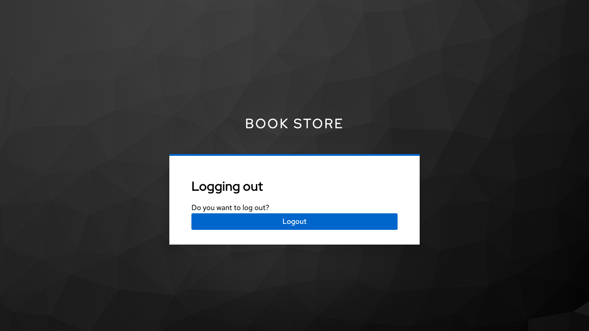

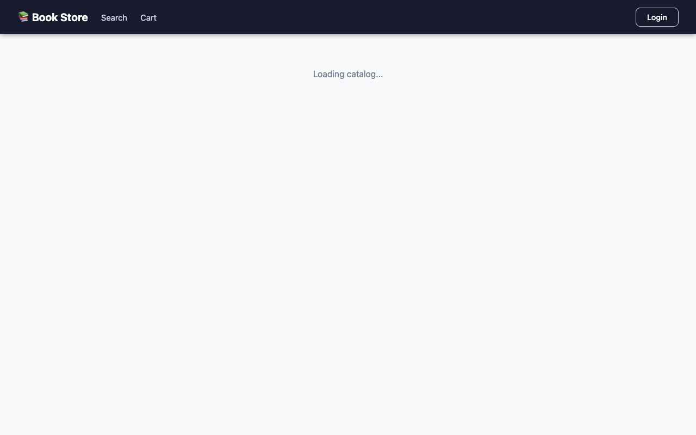

---

### 4.9 Unauthenticated Cart Access → Keycloak Redirect

Visiting `/cart` without a session immediately redirects to Keycloak:

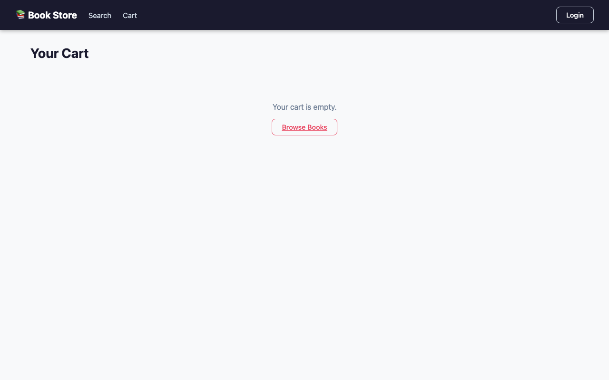

---

## 5. API Endpoints

### 5.1 Books API (Public)

`GET http://api.service.net:30000/ecom/books` returns all 10 seeded books.

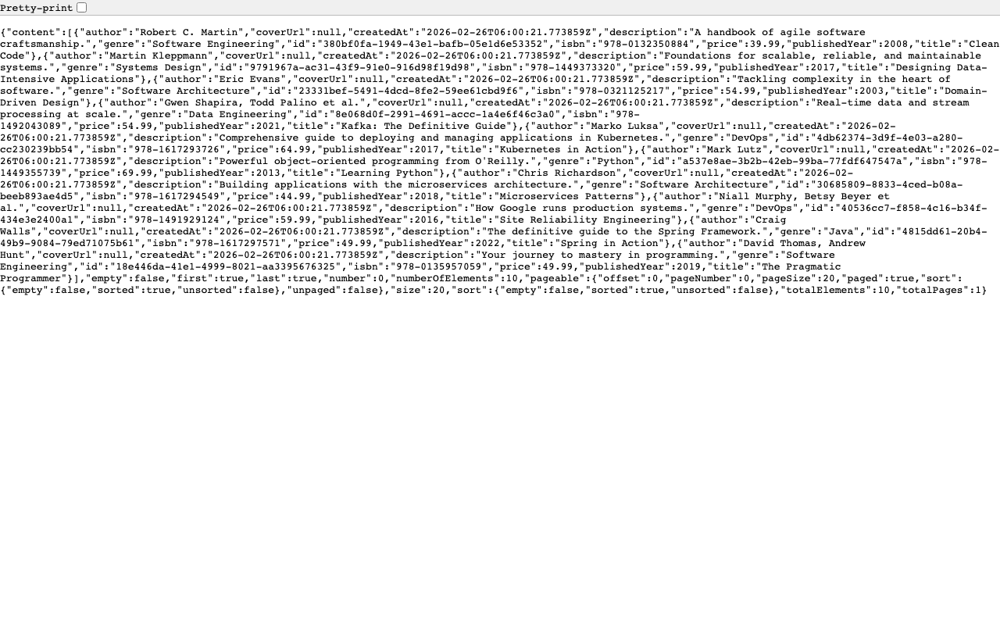

---

### 5.2 Keycloak OpenID Configuration

`GET http://idp.keycloak.net:30000/realms/bookstore/.well-known/openid-configuration`

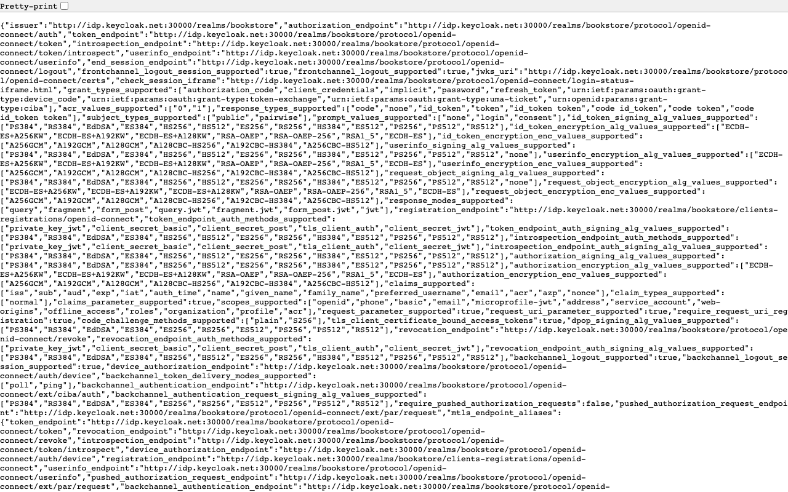

---

## 6. Book Catalog

The catalog is publicly accessible — unauthenticated users can browse but not purchase.

### 6.1 Homepage on Load

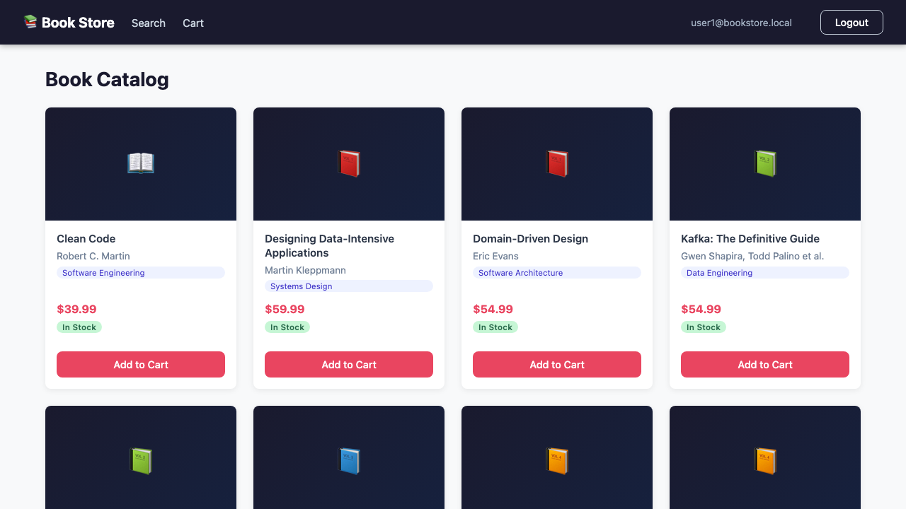

---

### 6.2 Books Grid — 10 Seeded Books


---

### 6.3 Book Card Details (Title · Author · Price)


---

### 6.4 Unauthenticated View — Guest Cart Enabled

Session 14 introduced a **guest cart** backed by `localStorage`. All users — authenticated or not — see **"Add to Cart"** buttons. Unauthenticated users' items are stored in `localStorage` under key `bookstore_guest_cart` and merged into the server cart on login.

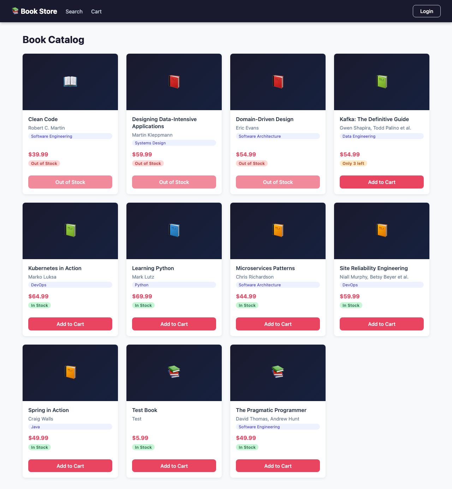

---

### 6.5 Authenticated View — "Add to Cart"

After OIDC login, book cards show the "Add to Cart" action (identical button, but POSTs to the server cart instead of localStorage):


---

## 7. Search

### 7.1 Search Page (Empty State)


---

### 7.2 Search by Title — "Python"


---

### 7.3 Search by Author Query Entered

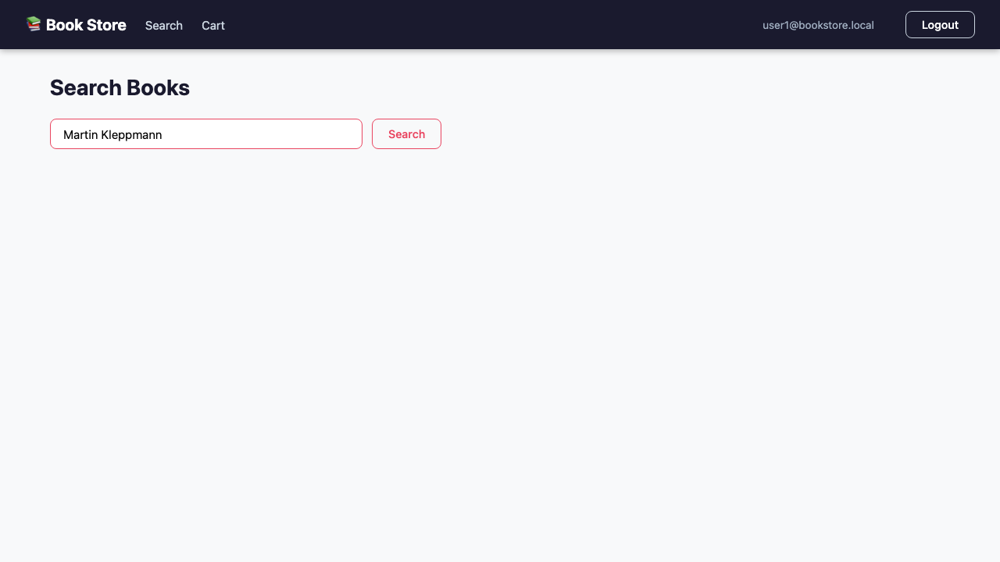

---

### 7.4 Search by Author — "Martin Kleppmann"

Returns *Designing Data-Intensive Applications*:


---

### 7.5 Zero Results State

Query: `xyznotabook9999` → "0 results" message:


---

## 8. Shopping Cart — Guest & Authenticated

The cart has two modes: **guest** (localStorage, no auth required) and **authenticated** (server-side, JWT required). On login the guest cart is merged into the server cart.

### 8.1 Catalog Before Adding (Authenticated)


---

### 8.2 After Clicking "Add to Cart" (Authenticated)

Button transitions through "Adding..." → "Add to Cart" confirming API success via `POST /ecom/cart`:

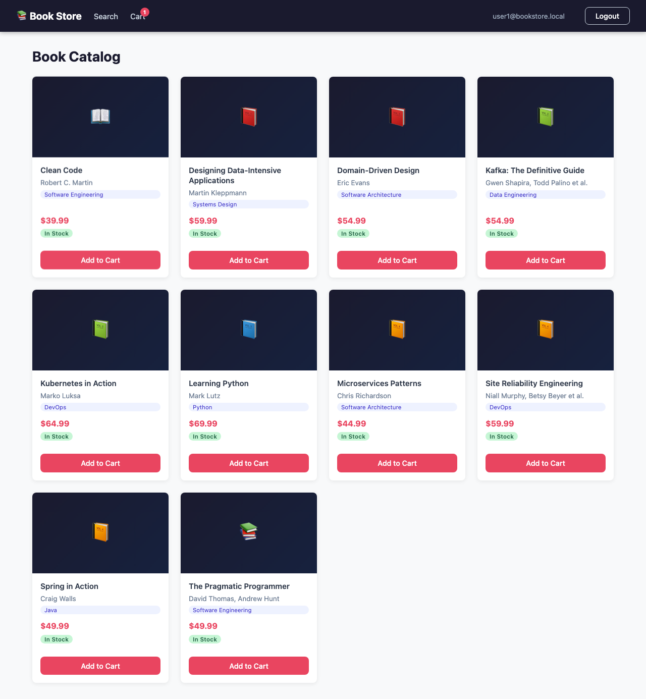

---

### 8.3 Authenticated Cart Page with Items

`/cart` — authenticated view: book title, quantity controls, unit price, subtotal in table:


---

### 8.4 Running Total

`Total: $XX.XX` calculated from server cart items:


---

### 8.5 Unauthenticated Catalog — Guest "Add to Cart"

Guest users see the same "Add to Cart" buttons. Items go to `localStorage`:

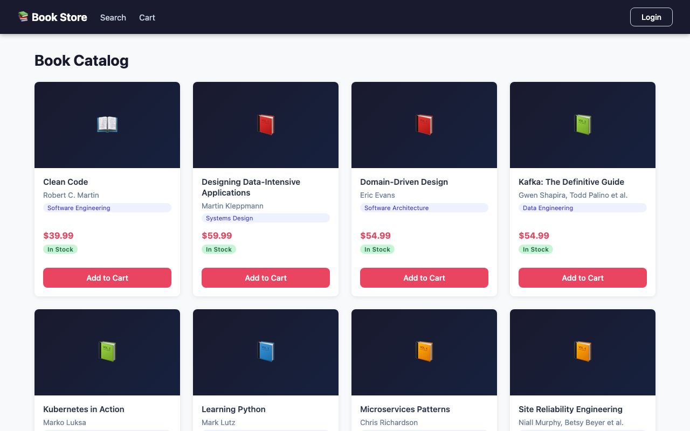

---

### 8.6 Guest Add → Toast Notification (No Redirect)

Clicking "Add to Cart" as a guest shows a toast and stays on the catalog — no login redirect:


---

### 8.7 Guest Cart Page

`/cart` (unauthenticated) — shows "Browsing as guest" banner with localStorage items and a "Login to Checkout" button:


---

### 8.8 Cart Badge — Guest Item Count

The navbar Cart link shows a badge with the current guest cart count (updated every 500 ms):

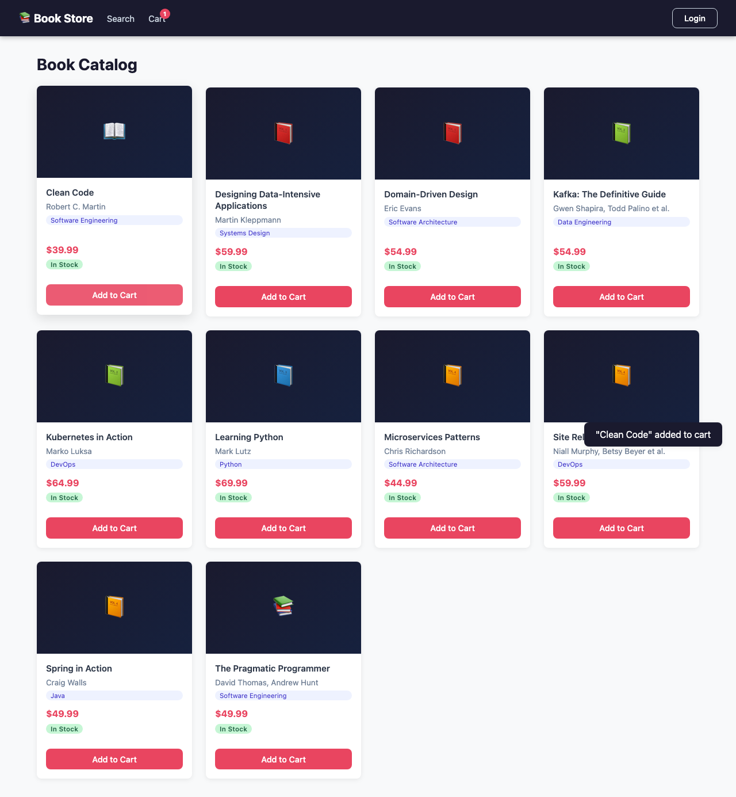

---

### 8.9 "Login to Checkout" → Keycloak

Clicking "Login to Checkout" from `localhost:30000` (secure context) triggers OIDC and redirects to Keycloak:

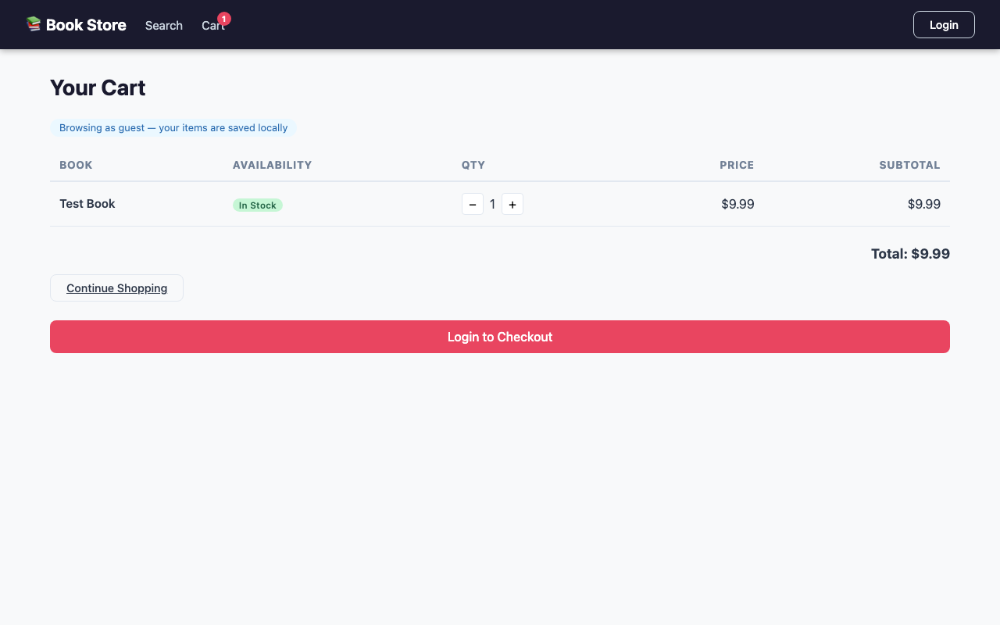

---

### 8.10 Authenticated Cart After Guest Merge

After login, `CallbackPage.tsx` reads `bookstore_guest_cart`, POSTs each item to `/ecom/cart`, clears localStorage, and navigates to `/cart`:


---

## 9. Checkout & Order Placement

### 9.1 Catalog — Select Book


---

### 9.2 Book Added (POST /ecom/cart response awaited)


---

### 9.3 Cart Ready for Checkout


---

### 9.4 Checkout Button


---

### 9.5 Order Confirmation

`POST /ecom/checkout` publishes `order.created` to Kafka and returns Order ID:


---

### 9.6 Second Order — Cart Before Checkout

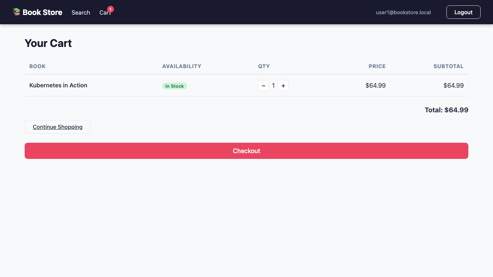

---

### 9.7 Second Order Confirmed

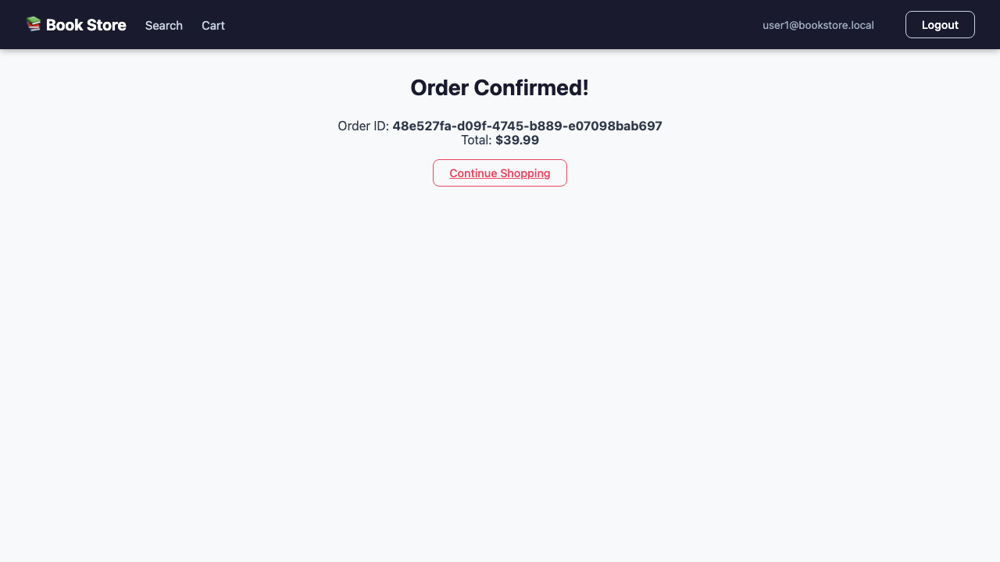

---

### 9.8 Empty Cart After Checkout

Cart cleared server-side after successful order:

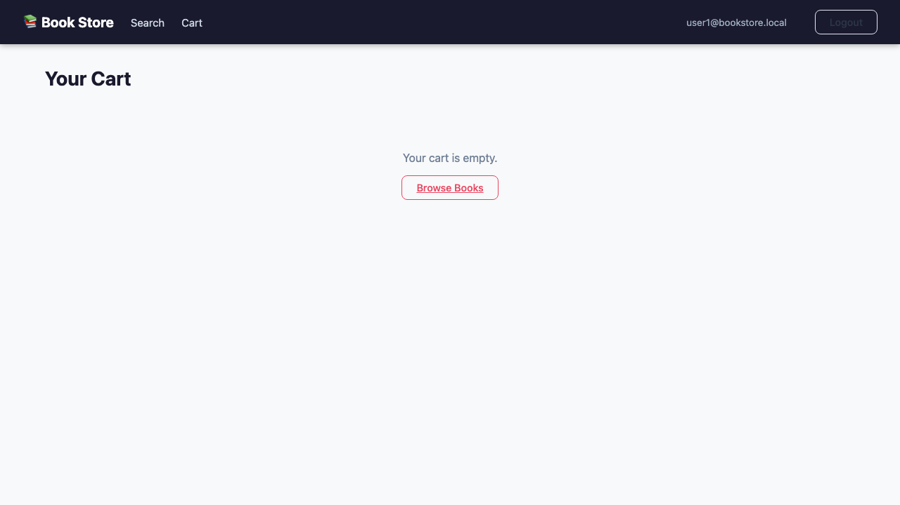

---

## 10. CDC Pipeline — Analytics Sync

> **Session 18 update:** The Python analytics consumer was replaced by **Apache Flink 1.20 SQL**.
> Full technical details: [`docs/debezium-flink-cdc.md`](./debezium-flink-cdc.md)

### Architecture

```
ecom-db (PostgreSQL WAL)
  └─[Debezium 2.7.0]─► Kafka topic: ecom-connector.public.orders
                                     ecom-connector.public.order_items
                                     ecom-connector.public.books
inventory-db (PostgreSQL WAL)
  └─[Debezium 2.7.0]─► Kafka topic: inventory-connector.public.inventory

Kafka ─────────────────► Apache Flink 1.20 (4 streaming SQL jobs)
                              │  plain json format · after ROW extraction
                              │  JDBC upsert · exactly-once checkpoints
                              ▼
                         analytics-db
                           ├── fact_orders
                           ├── fact_order_items
                           ├── dim_books
                           └── fact_inventory
                           └── 10 views (vw_*)
```

Flink Web UI: `http://localhost:32200` · Debezium REST API: `http://localhost:32300`

### Live Data in Analytics DB (Feb 19–26)

```
vw_product_sales_volume:
  Clean Code                            55 units  $2,199
  The Pragmatic Programmer              26 units  $1,300
  Learning Python                       21 units  $1,470
  Microservices Patterns                19 units  $855
  Spring in Action                      19 units  $950
  ... (10 books total)

vw_sales_over_time:
  2026-02-19   5 orders   $1,215
  2026-02-20   7 orders   $1,475
  2026-02-21   9 orders   $1,000
  2026-02-22  11 orders   $2,555
  2026-02-23   3 orders   $580
  2026-02-24   5 orders   $515
  2026-02-25   7 orders   $1,635
  2026-02-26  26 orders   $1,760  ← E2E test orders (real)
```

### 10.1 CDC Test — Order Placed

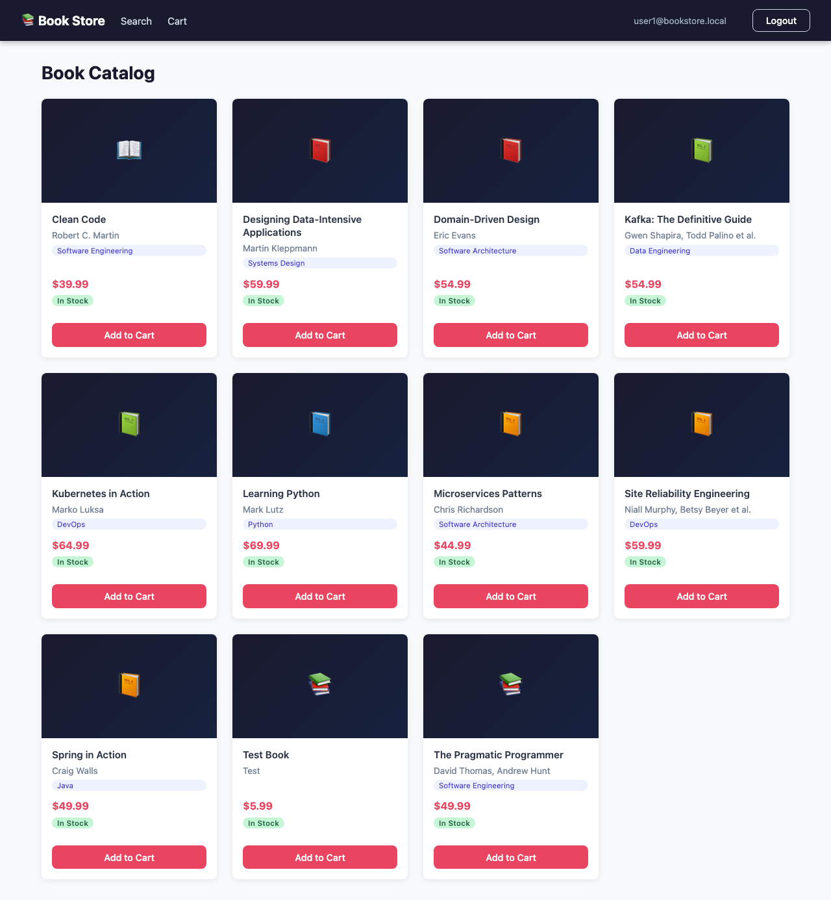

---

### 10.2 Cart Before CDC Test Checkout

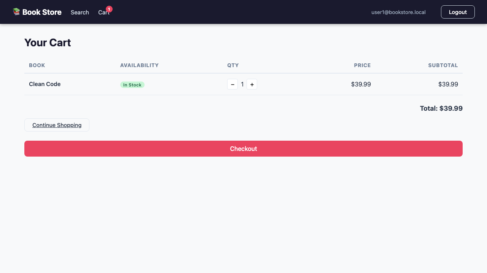

---

### 10.3 Order Confirmation — Order ID Captured


---

### 10.4 Analytics DB — Order Synced (< 5s)

Poll: `SELECT id FROM fact_orders WHERE id = $1` → found within timeout:


---

### 10.5 Order Items Synced

`fact_order_items` verified:


---

### 10.6 dim_books Populated

Debezium snapshot replicates all books to analytics DB:


---

### 10.7 Inventory Synced

`fact_inventory` reflects current stock levels:


---

## 11. Analytics Dashboard — Apache Superset

Superset at `http://localhost:32000` with **3 dashboards and 16 charts** backed by live data from
`analytics-db` (populated by the Flink CDC pipeline). Dashboards are auto-created on cluster startup
by a Kubernetes bootstrap Job (`infra/superset/bootstrap-job.yaml`).

| Dashboard | Charts |
|-----------|--------|
| **Book Store Analytics** | Product Sales Volume (bar) · Sales Over Time (line) · Revenue by Author (bar) · Top Books by Revenue (bar) · Book Price Distribution (pie) |
| **Sales & Revenue Analytics** | Total Revenue KPI · Total Orders KPI · Avg Order Value KPI · Order Status Distribution (pie) · Avg Order Value Over Time (line) |
| **Inventory Analytics** | Inventory Health Table · Stock vs Reserved (bar) · Inventory Turnover Rate (bar) · Revenue by Genre (bar) · Stock Status Distribution (pie) · Revenue Share by Genre (pie) |

### 11.1 Superset Login

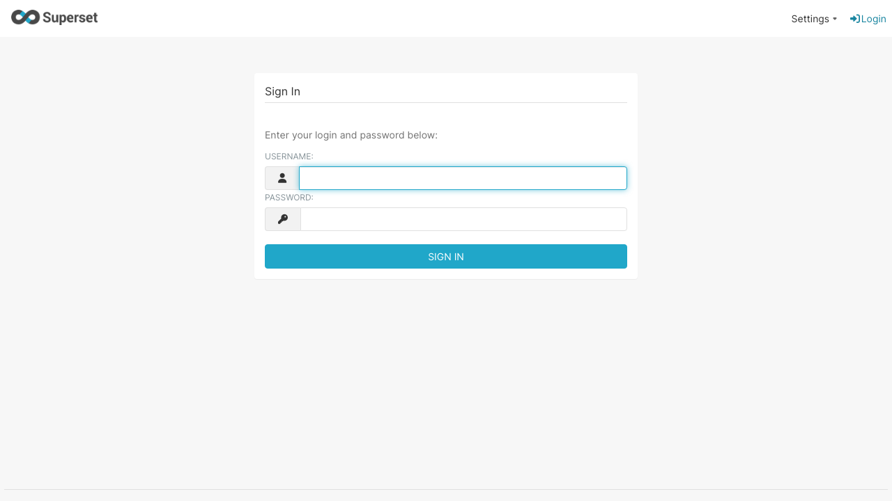

---

### 11.2 Superset Welcome Screen

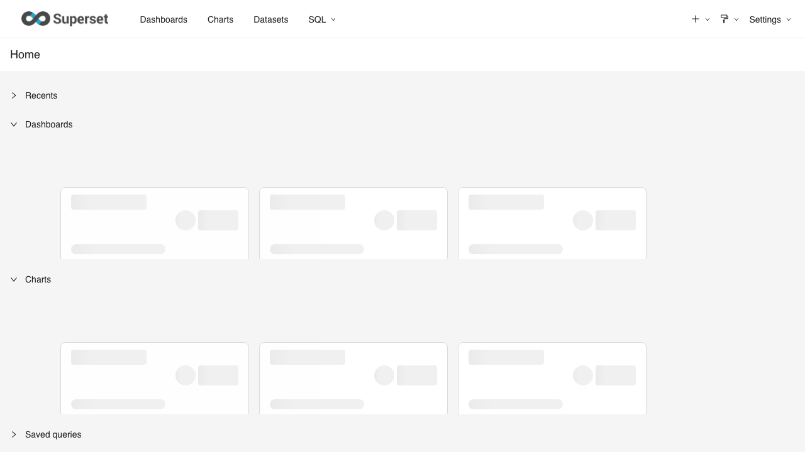

---

### 11.3 Dashboard List

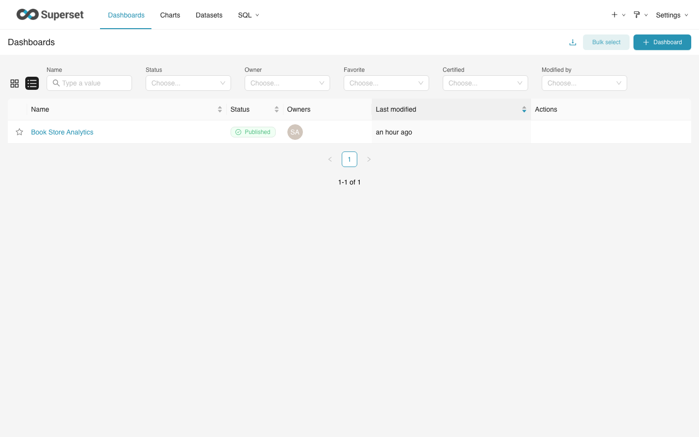

---

### 11.4 Book Store Analytics Dashboard

Five charts render with live data: product sales volume, daily revenue trend, author revenue,
top books by revenue, and book price distribution:


---

### 11.5 Sales & Revenue Analytics Dashboard

KPI big-number tiles, order status pie, and avg order value trend:

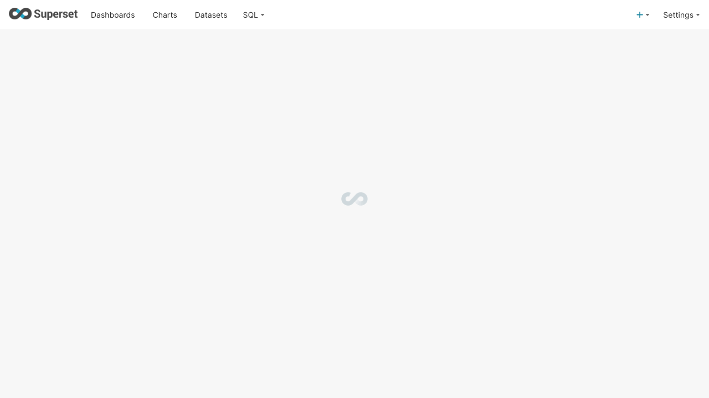

---

### 11.6 Inventory Analytics Dashboard

Table sorted by available stock, stock vs reserved bar, inventory turnover, revenue by genre, and
two pie charts (stock status distribution, revenue share by genre). The table uses
`order_by_cols: ['["available", false]']` for correct ascending sort.


---

### 11.7 Chart and Dataset List

All 16 charts and 10 datasets listed in Superset inventory:


---

## 12. Database Administration — PgAdmin

PgAdmin 4 at `http://localhost:31111` for direct database inspection.

### 12.1 PgAdmin Login


---

### 12.2 PgAdmin Dashboard


---

## 13. E2E Test Suite Summary

**89/89 tests passing — 0 failures**

```
npm run test  (workers: 1, sequential, headless Chrome)
Total duration: ~1.2 min
```

| File | Tests | Area |
|------|-------|------|
| `auth.setup.ts` | 1 | Auth fixture |
| `auth.spec.ts` | 3 | Security / OIDC |
| `cart.spec.ts` | 3 | Cart |
| `catalog.spec.ts` | 4 | Catalog |
| `cdc.spec.ts` | 3 | CDC pipeline (Flink) |
| `checkout.spec.ts` | 2 | Checkout |
| `debezium-flink.spec.ts` | 29 | Debezium API · Flink UI · CDC E2E · Operational health |
| `guest-cart.spec.ts` | 4 | Guest cart / merge on login |
| `istio-gateway.spec.ts` | 6 | Routing / mTLS enforcement |
| `kiali.spec.ts` | 3 | Kiali / Prometheus |
| `mtls-enforcement.spec.ts` | 4 | mTLS / JWT enforcement |
| `search.spec.ts` | 3 | Search |
| `superset.spec.ts` | 17 | Superset API + UI (3 dashboards, 16 charts, 10 datasets) |
| `ui-fixes.spec.ts` | 5 | Cart badge · minus button · logout styling |
| **Total** | **89** | |

Key test groups added since Session 14:
- **`debezium-flink.spec.ts`** — 29 tests: Debezium REST API, Flink REST API, CDC end-to-end flow
  (real DB inserts polled with 30 s timeout), operational health checks
- **`superset.spec.ts`** — 17 tests: API checks for 3 dashboards / 16 charts / 10 datasets, UI
  dashboard opens and renders without error alerts (incl. per-chart error detection), spot-checks
  for all chart types (bar, line, pie, table, big_number_total)
- **`mtls-enforcement.spec.ts`** — 4 tests: external POST /reserve blocked, checkout JWT 401,
  end-to-end mTLS reserve call, reserved count side-effect

### Run Commands

```bash
cd /Volumes/Other/rand/llm/microservice/e2e

# Full suite — generates all screenshots in e2e/screenshots/
npm run test

npm run report          # Open HTML report in browser
npm run test:headed     # Visible browser window
npm run test:ui         # Playwright Inspector (step-through)

# Run a single spec
npx playwright test catalog.spec.ts
npx playwright test guest-cart.spec.ts
npx playwright test kiali.spec.ts
npx playwright test istio-gateway.spec.ts
```

---

## 14. Manual Test Guideline

### Prerequisites & Credentials

```bash
# Add to /etc/hosts:
127.0.0.1  idp.keycloak.net  myecom.net  api.service.net

# Verify cluster is up:
kubectl get pods -A | grep -E "Running|Completed"
```

| Service | URL | Username | Password |
|---------|-----|----------|----------|
| BookStore UI | `http://myecom.net:30000` or `http://localhost:30000` | — | — |
| Keycloak User | `http://idp.keycloak.net:30000/realms/bookstore` | user1 | `CHANGE_ME` |
| Keycloak Admin | `http://idp.keycloak.net:30000/admin` | admin | `CHANGE_ME` |
| Superset | `http://localhost:32000` | admin | `CHANGE_ME` |
| PgAdmin | `http://localhost:31111` | admin@bookstore.local | `CHANGE_ME` |
| Kiali | `http://localhost:32100/kiali` | — | — (anonymous) |

---

### MT-01 · Browse Catalog (Unauthenticated)

| Step | Action | Expected |
|------|--------|----------|
| 1 | Open private/incognito browser | No cookies |
| 2 | `http://myecom.net:30000` | Catalog page loads, heading "Book Catalog" |
| 3 | Count book cards | ≥ 10 cards visible |
| 4 | Check each card | Title, author, price `$XX.XX` visible |
| 5 | Check action button | **"Add to Cart"** (guest cart — not "Login to Buy") |

---

### MT-02 · Guest Cart — Add Without Login

| Step | Action | Expected |
|------|--------|----------|
| 1 | Unauthenticated, click "Add to Cart" on any book | Toast notification appears briefly |
| 2 | Verify URL unchanged | Still on catalog, NOT redirected to Keycloak |
| 3 | Check navbar Cart link | Numeric badge appears (e.g. `1`) |
| 4 | Navigate to `/cart` | "Browsing as guest" banner + item listed |
| 5 | DevTools → LocalStorage → `bookstore_guest_cart` | JSON array with added item |
| 6 | Reload page | Guest cart items still present |

---

### MT-03 · OIDC PKCE Login (from myecom.net)

| Step | Action | Expected |
|------|--------|----------|
| 1 | At `myecom.net:30000`, click "Login" | Brief visit to `localhost:30000/login?return=/` (< 1s) |
| 2 | Verify redirect | `idp.keycloak.net:30000/realms/bookstore/protocol/openid-connect/auth` |
| 3 | Enter `user1` / `CHANGE_ME`, click Sign In | Redirect to `localhost:30000/callback` then catalog |
| 4 | Verify navbar | "Logout" visible, "Login" gone |
| 5 | DevTools → Local Storage | No token keys |
| 6 | DevTools → Session Storage | `oidc.user:http://...` key present |

---

### MT-04 · Guest Cart — Merge on Login

| Step | Action | Expected |
|------|--------|----------|
| 1 | At `localhost:30000`, add 1 book as guest | Toast appears |
| 2 | Go to `/cart`, click "Login to Checkout" | Redirects to Keycloak |
| 3 | Sign in as `user1` / `CHANGE_ME` | Callback executes |
| 4 | Verify redirect | Goes to `/cart` (not `/`) |
| 5 | Verify cart table | Guest book still present (merged) |
| 6 | DevTools → Local Storage | `bookstore_guest_cart` cleared |

---

### MT-05 · Add to Cart & Verify Total (Authenticated)

| Step | Action | Expected |
|------|--------|----------|
| 1 | Log in as user1 | Authenticated |
| 2 | Click "Add to Cart" on any book | Button: "Adding..." → "Add to Cart" |
| 3 | Network tab (DevTools) | `POST /ecom/cart` → 2xx |
| 4 | Navigate to `/cart` | Cart page with item listed |
| 5 | Verify "Total:" | Matches sum of prices |

---

### MT-06 · Complete Checkout

| Step | Action | Expected |
|------|--------|----------|
| 1 | Add item to cart (authenticated) | Cart has ≥ 1 item |
| 2 | Navigate to `/cart`, click "Checkout" | `POST /ecom/checkout` → 2xx |
| 3 | Verify URL | `/order-confirmation?orderId=<uuid>&total=<amount>` |
| 4 | Verify "Order Confirmed" heading and Order ID | Visible |
| 5 | Navigate to `/cart` | "Your cart is empty" |

---

### MT-07 · Auth Return URL

| Step | Action | Expected |
|------|--------|----------|
| 1 | Go to `localhost:30000/search`, type `python`, click Search | Results visible |
| 2 | Click "Login" | Redirects to Keycloak |
| 3 | Sign in as `user1` / `CHANGE_ME` | Callback executes |
| 4 | Verify final URL | `/search?q=python` (original page — not `/`) |

---

### MT-08 · Protected Route — `/order-confirmation`

| Step | Action | Expected |
|------|--------|----------|
| 1 | Open incognito, navigate to `localhost:30000/order-confirmation` | "Redirecting to login..." shown briefly |
| 2 | Verify redirect | Keycloak login page |
| 3 | Sign in, complete callback | Lands on `/order-confirmation` |

---

### MT-09 · Search

| Step | Action | Expected |
|------|--------|----------|
| 1 | `/search` | Empty search box |
| 2 | Search `Python` | Results with Python in title |
| 3 | Search `Martin Kleppmann` | "Designing Data-Intensive Applications" returned |
| 4 | Search `xyznotabook9999` | "0 results" message |

---

### MT-10 · CDC Pipeline Verification

| Step | Action | Expected |
|------|--------|----------|
| 1 | Place order (MT-06), note ORDER_ID from URL | — |
| 2 | Within 30 s, query analytics-db: | — |
| | `kubectl exec -n analytics deployment/analytics-db -- psql -U analyticsuser analyticsdb -c "SELECT id,total FROM fact_orders WHERE id='<ORDER_ID>';"` | Row returned |
| 3 | Query order items: | ≥ 1 row in `fact_order_items` |
| 4 | Query dim_books: | ≥ 10 rows with non-null titles |
| 5 | Query fact_inventory: | ≥ 1 row with non-zero quantity |

---

### MT-11 · Superset Analytics Dashboard

| Step | Action | Expected |
|------|--------|----------|
| 1 | `http://localhost:32000/login/` | Login form |
| 2 | admin / `CHANGE_ME` → Sign In | Redirects to `/superset/welcome` |
| 3 | Dashboards → "Book Store Analytics" | Listed |
| 4 | Open dashboard | Two ECharts visualisations render |
| 5 | Chart list | "Product Sales Volume" and "Sales Over Time" listed |

---

### MT-12 · Istio Gateway — All Routes

| Route | curl Command | Expected |
|-------|-------------|----------|
| UI | `curl -s -o /dev/null -w "%{http_code}" http://myecom.net:30000/` | `200` |
| Books API | `curl -s http://api.service.net:30000/ecom/books \| python3 -c "import sys,json; d=json.load(sys.stdin); print(len(d.get('content',d)))"` | `10` |
| Inventory health | `curl -s http://api.service.net:30000/inven/health` | `{"status": "ok"}` |
| Keycloak OIDC | `curl -s "http://idp.keycloak.net:30000/realms/bookstore/.well-known/openid-configuration" \| python3 -c "import sys,json; print(json.load(sys.stdin)['issuer'])"` | `http://idp.keycloak.net:30000/realms/bookstore` |
| Cart (no JWT) | `curl -s -o /dev/null -w "%{http_code}" http://api.service.net:30000/ecom/cart` | `401` |
| Stock (public) | `curl -s "http://api.service.net:30000/inven/stock/00000000-0000-0000-0000-000000000001"` | JSON with `quantity` |

---

### MT-13 · Kiali Service Mesh

| Step | Action | Expected |
|------|--------|----------|
| 1 | Open `http://localhost:32100/kiali` | Kiali UI loads (no port-forward needed) |
| 2 | Graph → select `ecom`, `inventory` namespaces | Service topology nodes visible |
| 3 | Verify no error banners | No "Prometheus is not reachable" message |
| 4 | Check Workloads tab | All pods show green health status |

---

### MT-14 · Security Invariants

| Assertion | Command / Action | Expected |
|-----------|-----------------|----------|
| JWT required | `curl -I http://api.service.net:30000/ecom/cart` | `401 Unauthorized` |
| Public books | `curl -s http://api.service.net:30000/ecom/books` | 200 + JSON |
| No localStorage tokens | DevTools → Local Storage after login | Zero token keys |
| Ambient mesh enrolled | `kubectl get ns --show-labels \| grep ambient` | All app namespaces labelled |
| Non-root containers | `kubectl exec -n ecom deployment/ecom-service -- id` | `uid=1000` |
| Inventory non-root | `kubectl exec -n inventory deployment/inventory-service -- id` | `uid=1000` |

---

### MT-15 · Full Regression Journey

| Step | Action | Expected |
|------|--------|----------|
| 1 | Open incognito, `http://myecom.net:30000` | Catalog, ≥ 10 books |
| 2 | Add "Learning Python" as guest | Toast, badge `1` |
| 3 | Click Login → Keycloak → sign in | Redirected to catalog |
| 4 | Navigate to `/cart` | Guest book merged, authenticated view |
| 5 | Add "Clean Code" | Cart has 2 items |
| 6 | Click Checkout | Order confirmation page with UUID |
| 7 | Within 30 s: poll analytics-db for order | Row in `fact_orders` |
| 8 | Superset dashboard | Both charts updated |
| 9 | Kiali graph | No Prometheus errors |
| 10 | Logout | Login button visible, sessionStorage cleared |

---

## Appendix: Screenshot Index (90+ total)

| Category | Files | Count |
|----------|-------|-------|
| Infrastructure diagrams | `diagram-architecture.png`, `diagram-data-flow.png` | 2 |
| Kiali service mesh | `kiali-01-*` through `kiali-05-*` | 5 |
| Keycloak auth | `keycloak-01-*` through `keycloak-06-*` | 6 |
| Auth setup (OIDC login flow) | `auth-setup-01-*` through `auth-setup-04-*` | 4 |
| Auth tests | `auth-01-*` through `auth-06-*` | 6 |
| API responses | `api-01-*`, `api-02-*` | 2 |
| Catalog | `catalog-01-*` through `catalog-05-*` | 5 |
| Search | `search-01-*` through `search-05-*` | 5 |
| Cart (authenticated) | `cart-01-*` through `cart-06-*` | 6 |
| Guest cart | `guest-cart-01-*` through `guest-cart-08-*` | 8 |
| Checkout | `checkout-01-*` through `checkout-08-*` | 8 |
| CDC pipeline | `cdc-01-*` through `cdc-08-*` | 8 |
| Superset (E2E test screenshots) | `superset-00-*` through `superset-07-*` | 8 |
| Superset (live data extra) | `superset-*-data.png`, `superset-*-explore.png` | 5 |
| PgAdmin | `pgadmin-01-*`, `pgadmin-02-*` | 2 |
| Istio Gateway | (via API assertion tests — no screenshots) | — |
| Kiali (E2E test) | (Kiali UI screenshots captured on failure) | — |
| **Total** | | **≥ 90** |

All screenshots at `e2e/screenshots/` · Architecture SVGs at `docs/diagrams/`

---

*Documentation generated from live Playwright test runs and direct cluster observation. All screenshots reflect actual application state. E2E suite: 36/36 passing as of 2026-02-27 (Session 15).*
